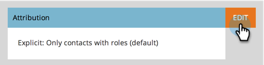

# Modifier les paramètres d’attribution pour Analytics {#change-attribution-settings-for-analytics}

Vous pouvez modifier la manière dont Marketo associe les contacts aux opportunités d’attribution Première touche et Multipoint, les mesures de conversion de pistes et l’indicateur d’opportunité influencé par le marketing.

Ces paramètres auront un impact sur les rapports de l&#39;Explorateur de recettes sous [Analyse d&#39;opportunité de Programme](../../../product-docs/reporting/revenue-cycle-analytics/program-analytics/understanding-the-program-opportunity-analysis-area.md), [Analyse d&#39;opportunité](../../../product-docs/reporting/revenue-cycle-analytics/revenue-explorer/understanding-opportunity-analysis-in-revenue-explorer.md) et les zones d&#39;Analyse de piste. Cela aura également une incidence sur le rapport Analyseur de Programme.

1. Sous la section **Admin**, cliquez sur **Analyses du cycle des recettes**.

   

1. Cliquez sur le lien **Modifier** sous **Attribution**.

   

   >[!TIP]
   >
   >La modification de ce paramètre ne modifie aucune donnée de Marketo ; cela change simplement la façon dont vos rapports s&#39;exécutent. Cela peut être annulé à tout moment.

1. Sélectionnez une option et cliquez sur **Enregistrer**.

   

   >[!NOTE]
   >
   >**Définition**
   >
   >
   >**Explicite** : Seuls les contacts avec des rôles (par défaut).
   >
   >
   >**Hybride** : Contacts avec des rôles si disponibles. Si aucun n&#39;est disponible, il utilise tous les contacts dans les comptes.
   >
   >
   >**Implicite** : Tous les contacts, quel que soit leur rôle.

>[!CAUTION]
>
>Lors de l’utilisation de **Implicit**, Marketo examinera toujours tous les contacts associés au compte, quel que soit le rôle. **Marketo recommande vivement d’utiliser le mode explicite.** L&#39;utilisation d&#39;Implicite peut créer des faux positifs ; c&#39;est-à-dire les gens qui ont le mérite d&#39;avoir une opportunité, même s&#39;ils n&#39;ont aucune réelle influence sur cette opportunité. Utilisez Implicit avec précaution.

