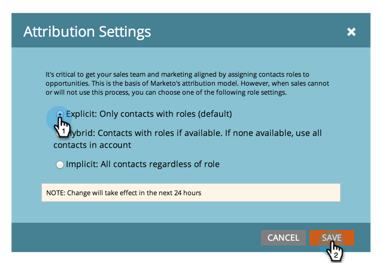

# Modification des paramètres d’attribution pour Analytics {#change-attribution-settings-for-analytics}

Vous pouvez modifier la manière dont Marketo lie les contacts aux opportunités pour l’attribution Première touche et multipoint, les mesures de conversion de prospect et l’indicateur d’opportunité influencé par le marketing.

Ces paramètres auront un impact sur les rapports [!UICONTROL Explorateur des recettes] dans les zones [  Analyse des opportunités de programme](/help/marketo/product-docs/reporting/revenue-cycle-analytics/program-analytics/understanding-the-program-opportunity-analysis-area.md), [Analyse des opportunités](/help/marketo/product-docs/reporting/revenue-cycle-analytics/revenue-explorer/understanding-opportunity-analysis-in-revenue-explorer.md) et Analyse des pistes. Cela aura également une incidence sur le rapport [!UICONTROL Program Analyzer].

1. Accédez à la zone **[!UICONTROL Admin]**.

   

1. Cliquez sur **[!UICONTROL Revenue Cycle Analytics]**.

   

1. Cliquez sur le lien **[!UICONTROL Edit]** sous **[!UICONTROL Attribution]**.

   

   >[!TIP]
   >
   >La modification de ce paramètre ne modifie aucune donnée Marketo ; elle modifie simplement la manière dont vos rapports s’exécutent. Cette opération peut être annulée à tout moment.

1. Sélectionnez une option et cliquez sur **[!UICONTROL Enregistrer]**.

   

   >[!NOTE]
   >
   >**Définition**
   >
   >**[!UICONTROL Explicit]** : seuls les contacts avec des rôles (par défaut).
   >
   >**[!UICONTROL Hybride]** : contacts avec des rôles si disponible. Si aucun contact n’est disponible, il utilise tous les contacts des comptes.
   >
   >**[!UICONTROL Implicit]** : tous les contacts, quel que soit leur rôle.

>[!CAUTION]
>
>Lors de l’utilisation de **[!UICONTROL Implicit]**, Marketo examine toujours tous les contacts associés au compte, quel que soit leur rôle. **Marketo recommande vivement d&#39;utiliser le mode [!UICONTROL Explicit]**. L’utilisation de [!UICONTROL Implicit] peut créer des faux positifs ; c’est-à-dire des personnes qui ont le crédit d’une opportunité, même si elles n’ont aucune réelle influence sur l’opportunité. Utilisez [!UICONTROL Implicit] avec précaution.
