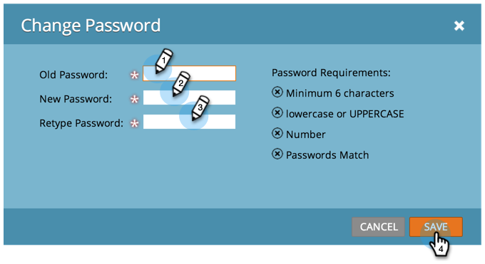

# Modification du mot de passe Marketo {#change-your-marketo-password}

Modifiez votre mot de passe Marketo en procédant comme suit.

1. Accédez à la zone **[!UICONTROL Admin]**.

   

1. Cliquez sur **[!UICONTROL Mon compte]**.

   

1. Cliquez sur **[!UICONTROL Modifier le mot de passe]**.

   

1. Saisissez l’ancien mot de passe et le nouveau mot de passe, puis cliquez sur **[!UICONTROL Enregistrer]**.

   

   >[!NOTE]
   >
   >Prenez note des exigences en matière de mot de passe lorsque vous effectuez la mise à jour.
