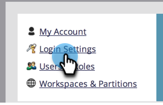

# Modifier les paramètres de sécurité de mot de passe {#change-your-password-security-settings}

Contrôlez la stratégie de mot de passe de votre abonnement. Voici comment procéder.

>[!NOTE]
>
>**Autorisations d’administrateur requises**

1. Accédez à la zone **[!UICONTROL Admin]**.

   

1. Cliquez sur **[!UICONTROL Paramètres de connexion]**.

   

1. Sous **[!UICONTROL Paramètres de sécurité]**, cliquez sur **[!UICONTROL Modifier]**.

   

1. Sélectionnez un **[!UICONTROL modèle]**. Pour les options avancées, cliquez sur le menu déroulant **[!UICONTROL Avancé]**.

   

   >[!NOTE]
   >
   >Un modèle est simplement une configuration préconfigurée. **[!UICONTROL Sécurité standard]** est une bonne chose. **[!UICONTROL Haute sécurité]** est la plus forte. **[!UICONTROL Personnalisé]** vous permet de créer le vôtre.

   >[!TIP]
   >
   >Dans **[!UICONTROL Personnalisé]**, cochez les cases pour indiquer les caractéristiques que vous souhaitez que les utilisateurs incluent lorsqu’ils créent des mots de passe.

1. Définissez la variable **[!UICONTROL Expiration]**. Cette fonctionnalité nécessite automatiquement que les utilisateurs réinitialisent leurs mots de passe après un certain temps. Cela inclut également l’utilisateur ou l’utilisatrice admin.

   

   >[!CAUTION]
   >
   >Les utilisateurs existants ne seront pas avertis des modifications. Définissez d’abord **[!UICONTROL Expiration]** sur 30 jours pour vous assurer que tout le monde a mis à jour les nouveaux paramètres, puis redéfinissez cette cadence sur votre cadence d’origine.

1. Définissez le **[!UICONTROL Délai d’expiration de la session inactive]**. Cela détermine la durée pendant laquelle un utilisateur peut rester inactif avant de devoir se reconnecter à Marketo.

   
