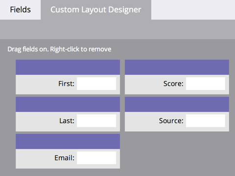

# Création d’un onglet personnalisé pour la page Détails de la personne {#creating-a-custom-tab-for-the-person-detail-page}

Si vous avez fréquemment besoin d’accéder à un ensemble spécifique de champs dans la page des détails d’une personne, pensez à créer une mise en page personnalisée.

1. Accédez à la zone **[!UICONTROL Admin]**.

   

1. Cliquez sur **[!UICONTROL Gestion des champs]**.

   

1. Cliquez sur l’onglet **[!UICONTROL Custom Layout Designer]**.

   

1. Recherchez un champ à ajouter, puis faites-le glisser et déposez-le dans la zone de travail.

   

1. Continuez à ajouter des champs jusqu’à ce que la disposition soit adaptée à vos besoins.

   

   >[!NOTE]
   >
   >Vous devez travailler avec deux colonnes.

   Si vous décidez de supprimer un champ, cliquez avec le bouton droit sur le champ à supprimer, puis cliquez sur **[!UICONTROL Supprimer]**.

   

   Lorsque vous chargez les détails d’une personne, vous pouvez utiliser votre mise en page personnalisée pour accéder aux informations qui vous intéressent.

   
