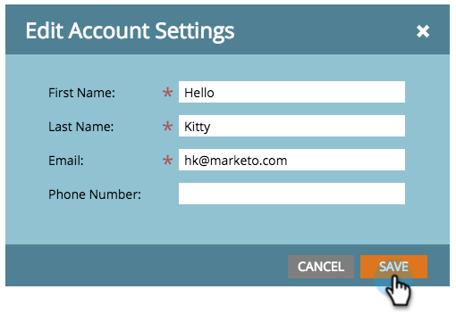

# Modifier les paramètres du compte {#edit-account-settings}

Vous devez modifier l’adresse électronique, le nom ou le numéro de téléphone du compte ? Découvrez comment ci-dessous.

>[!NOTE]
>
>**Autorisations d’administrateur requises**

1. Accédez à **Admin**.

   

1. Sélectionnez **Mon compte**.

   

1. Sélectionnez **Modifier les paramètres du compte**.

   

1. Effectuez vos modifications et cliquez sur **Enregistrer**.

   

   Ta-da ! Informations mises à jour.
