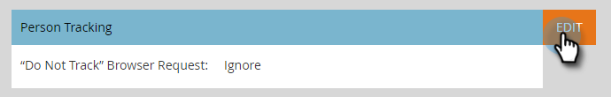

# Modifier Les Paramètres De Prise En Charge Du Navigateur « Ne Pas Suivre » {#edit-do-not-track-browser-support-settings}

« Ne pas suivre » est une demande de navigateur qui ne doit pas être suivie dans des systèmes tels que Marketo. Vous pouvez honorer cette demande en procédant comme suit.

>[!NOTE]
>
>**Autorisations d’administrateur requises**

>[!NOTE]
>
>Par défaut, l’option « Ne pas effectuer de suivi » est définie sur **[!UICONTROL Ignorer]**. Si c’est ce que vous souhaitez, vous n’avez aucune mesure à prendre.

1. Cliquez sur **[!UICONTROL Admin]**.

   

1. Cliquez sur **[!UICONTROL Munchkin]**.

   

1. Sous **[!UICONTROL Suivi des personnes]**, cliquez sur **[!UICONTROL Modifier]**.

   

1. Sélectionnez **[!UICONTROL Assistance]** et cliquez sur **[!UICONTROL Enregistrer]**.

   

   Après avoir enregistré les modifications, la mise à jour s’affiche.

   

   >[!NOTE]
   >
   >Il est recommandé de prendre en charge la fonction « Ne pas suivre ». En Europe, c&#39;est la loi !

   >[!TIP]
   >
   >Pour en savoir plus sur « Do Not Track » et son fonctionnement, consultez [cette page](https://en.wikipedia.org/wiki/Do_Not_Track).
