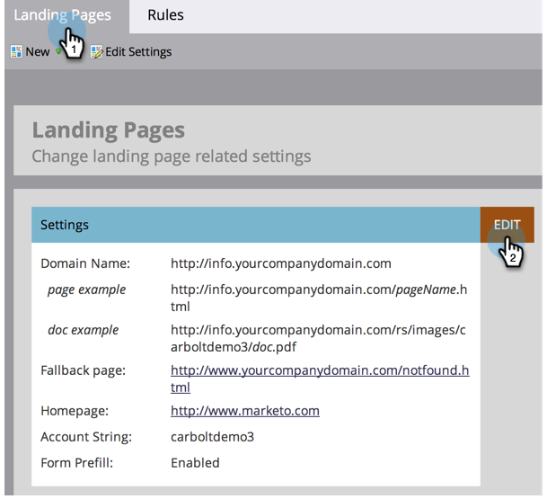
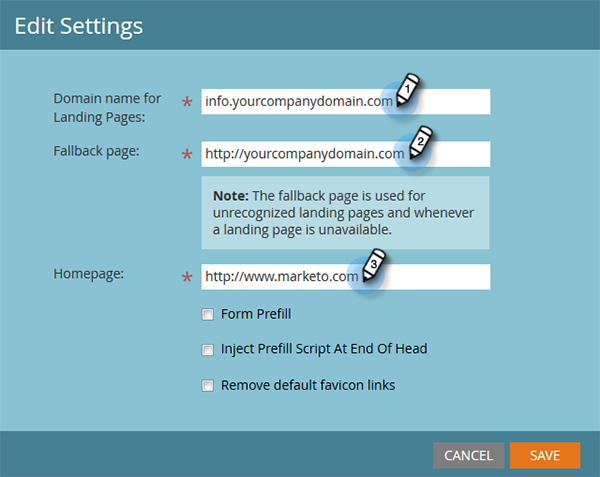

# Modifier les paramètres de la page d’entrée {#edit-landing-page-settings}

Vous pouvez modifier le nom de domaine et la page de secours, activer ou désactiver le préremplissage de formulaire, empêcher tout mauvais usage de votre landing page, etc. Voici comment.

>[!NOTE]
>
>**Autorisations d’administrateur requises**

1. Accédez à la zone **[!UICONTROL Admin]**.

   

1. Cliquez sur **[!UICONTROL Landing Pages]**.

   

1. Dans la section **[!UICONTROL Landing Pages]**, cliquez sur **[!UICONTROL Modifier]**.

   

1. Renseignez les informations sur votre domaine et votre page.

   

   | Terme | Définition |
   |---|---|
   | [!UICONTROL Nom de domaine pour les landing pages] | Il s’agit de votre CNAME. Un CNAME est la première partie de l’URL que vous donnez aux personnes pour les landing pages. Par exemple, dans `https://go.yourCompany.com`, le mot &quot;go&quot; est le CNAME. Vous pouvez avoir plusieurs, mais la plupart des gens utilisent seulement celui-ci. |
   | [!UICONTROL Page de secours] | C’est là que vous pouvez aller si la landing page n’existe pas ou est en panne. En savoir plus sur les [pages de secours](/help/marketo/product-docs/administration/settings/set-a-fallback-page.md). |
   | [!UICONTROL Page d’accueil] | Saisissez l’URL de votre site d’entreprise. |

1. Cochez la case **[!UICONTROL Préremplissage de formulaire]** pour permettre aux formulaires de préremplir les informations pour les personnes connues (cookies). Décochez pour bloquer.

   

   >[!NOTE]
   >
   >Si vous souhaitez que la balise `<script>` de préremplissage s’affiche à la fin de la balise `<head>` dans le code, cochez la case **[!UICONTROL Inject Prefill Script at End of Head]** (Injecter le script de préremplissage à la fin de l’en-tête). Laissez cette option décochée si vous souhaitez qu’elle s’affiche au début.
   >
   >Cochez la case **[!UICONTROL Supprimer les liens favicon par défaut]** pour empêcher Marketo d’insérer des liens favicon dans le code.

1. Après avoir effectué vos sélections, cliquez sur **[!UICONTROL Enregistrer]**.

   

   Très bon travail ! Vos landing pages contiennent maintenant les informations appropriées et doivent commencer à fonctionner immédiatement.
