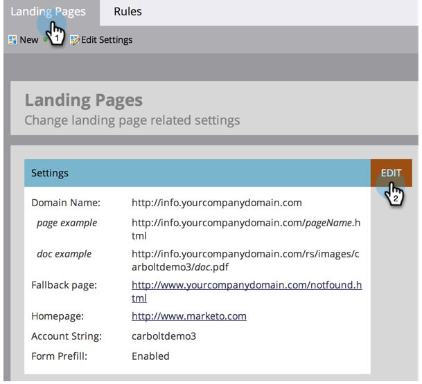
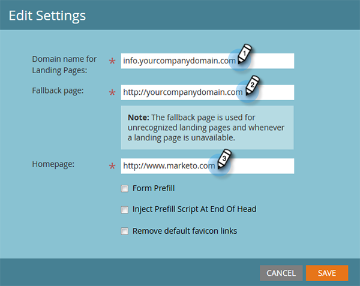

# Modifier les paramètres de la page de destination {#edit-landing-page-settings}

Vous pouvez modifier votre nom de domaine et votre page de secours, activer ou désactiver le préremplissage de formulaire, empêcher toute utilisation abusive de votre page de destination, etc. Suivez les étapes ci-après.

>[!NOTE]
>
>**Autorisations d’administration requises**

1. Accédez à la zone **[!UICONTROL Admin]**.

   

1. Cliquez sur **[!UICONTROL Pages de destination]**.

   

1. Dans la section **[!UICONTROL Pages de destination]**, cliquez sur **[!UICONTROL Modifier]**.

   

1. Saisissez les informations relatives à votre domaine et à votre page.

   

   | Terme | Définition |
   |---|---|
   | [!UICONTROL Nom de domaine pour les landing pages] | Il s’agit de votre CNAME. Un CNAME est la première partie de l’URL que vous fournissez aux personnes pour les pages de destination. Par exemple, dans `https://go.yourCompany.com`, le mot « go » correspond au CNAME. Vous pouvez en avoir plusieurs, mais la plupart des gens n’en utilisent qu’une seule. |
   | [!UICONTROL &#x200B; Page de secours &#x200B;] | C’est là que aller si la page de destination n’existe pas ou est en panne. En savoir plus sur les [pages de secours](/help/marketo/product-docs/administration/settings/set-a-fallback-page.md). |
   | [!UICONTROL Page d’accueil] | Saisissez l’URL de votre site d’entreprise. |

1. Cochez la case **[!UICONTROL Préremplissage de formulaire]** pour permettre aux formulaires de préremplir des informations pour des personnes connues (cookies). Décochez pour bloquer.

   

   >[!NOTE]
   >
   >Si vous souhaitez que la balise de `<script>` de préremplissage s’affiche à la fin de la balise `<head>` dans le code, cochez la case **[!UICONTROL Insérer un script de préremplissage à la fin de la tête]**. Ne cochez pas cette case si vous souhaitez qu’elle apparaisse au début.
   >
   >Cochez la case **[!UICONTROL Supprimer les liens favicon par défaut]** pour empêcher Marketo d’insérer des liens favicon dans le code.

1. Après avoir effectué vos sélections, cliquez sur **[!UICONTROL Enregistrer]**.

   

   Vos landing pages disposent désormais des informations appropriées et devraient commencer à fonctionner immédiatement.
