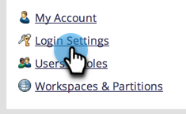

# Modifier l’expiration du lien dans les rapports et alertes {#edit-link-expiration-in-reports-and-alerts}

Les liens figurant dans les e-mails d’abonnement aux rapports expirent au bout de trois jours. Pour modifier le délai d’expiration de ces liens, procédez comme suit.

>[!NOTE]
>
>**Autorisations d’administrateur requises**

1. Accédez à la section **[!UICONTROL Admin]**.

   

1. Cliquez sur **[!UICONTROL Paramètres de connexion]**.

   

1. Cliquez sur **[!UICONTROL Modifier l’expiration de l’URL]**.

   

1. Dans la liste déroulante, sélectionnez le nombre de jours avant l’expiration du lien. Cliquez sur **[!UICONTROL Enregistrer]**

   

>[!IMPORTANT]
>
>Ce paramètre s’applique uniquement aux liens dans les rapports et les alertes. Elle ne s’applique **pas** au lien [rapport de téléchargement](/help/marketo/product-docs/reporting/basic-reporting/report-subscriptions/subscribe-to-a-smart-list.md#email-message) ou aux e-mails marketing envoyés par e-mail.
