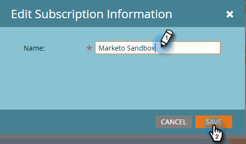

# Modifier les paramètres d’abonnement {#edit-subscription-settings}

Si vous avez accès à plusieurs abonnements Marketo et souhaitez vous assurer de celui que vous utilisez, essayez de donner un nom unique à chacun d’eux. Ce nom s’affiche ensuite en haut de votre page d’abonnement.

Par exemple, si vous travaillez à la fois sur des instances de production et Sandbox, vous pouvez nommer un abonnement **Production Marketo** et l’autre **Sandbox Marketo**.

1. Accédez à **[!UICONTROL Admin]**.

   

1. Cliquez sur **[!UICONTROL Mon compte]**.

   

1. Cliquez sur **[!UICONTROL Modifier les informations d’abonnement]**.

   

1. Apportez vos modifications et cliquez sur **[!UICONTROL Enregistrer]**.

   
