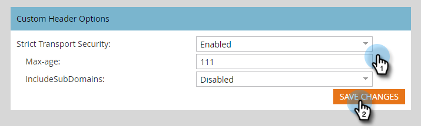

# En-têtes de lien de suivi des e-mails {#email-tracking-link-headers}

Suivez les étapes ci-dessous pour personnaliser les en-têtes de lien de suivi des e-mails.

1. Dans Marketo, cliquez sur **[!UICONTROL Admin]**.

   

1. Cliquez sur **[!UICONTROL Email]**.

   

1. Faites défiler jusqu’aux options d’en-tête personnalisé. Choisissez les paramètres souhaités et cliquez sur **[!UICONTROL Enregistrer les modifications]**.

   

<table>
 <tr>
  <td><strong>Strict-Transport-Security</strong></td>
  <td>Utilisez cette option pour garantir que les liens de tracking seront toujours diffusés via HTTPS (ne doit être défini que pour les abonnements disposant de liens de tracking sécurisés par SSL).</td>
 </tr>
</table>

>[!CAUTION]
>
>Il est important de passer en revue ces paramètres avec votre équipe informatique afin de déterminer la politique de votre entreprise à définir. Des paramètres incorrects peuvent empêcher certains visiteurs d’accéder à vos liens d’e-mail.
