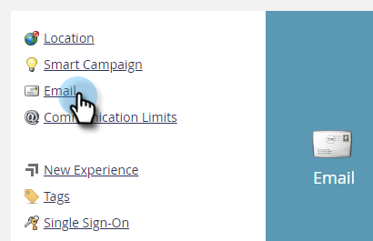

# En-têtes de lien de suivi des emails {#email-tracking-link-headers}

Suivez les étapes ci-dessous pour personnaliser les en-têtes de lien de suivi des emails.

1. Dans Marketo, cliquez sur **[!UICONTROL Admin]**.

   

1. Cliquez sur **[!UICONTROL Email]**.

   

1. Faites défiler jusqu’à Options d’en-tête personnalisé. Choisissez les paramètres voulus et cliquez sur **[!UICONTROL Enregistrer les modifications]**.

   

<table>
 <tr>
  <td><strong>Strict-Transport-Security</strong></td>
  <td>Utilisez cette option pour garantir que les liens de suivi seront toujours diffusés via HTTPS (ne doit être défini que pour les abonnements avec des liens de suivi sécurisés par SSL).</td>
 </tr>
</table>

>[!CAUTION]
>
>Il est important de passer en revue ces paramètres avec votre équipe informatique afin de déterminer la stratégie de votre entreprise. Des paramètres incorrects peuvent empêcher certains visiteurs d’accéder à vos liens de courriel.
