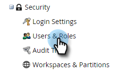
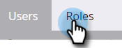
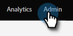

# Règles générales de validation du formulaire {#global-form-validation-rules}

Cette fonctionnalité vous permet de bloquer l’envoi de formulaires Marketo Engage à des domaines spécifiques.

## Activation de l’accès {#how-to-enable-access}

Avant de pouvoir utiliser cette fonctionnalité, vous devez activer son autorisation pour le rôle souhaité.

1. Dans Marketo, cliquez sur **[!UICONTROL Admin]**.

   

1. Cliquez sur **[!UICONTROL Utilisateurs et rôles]**.

   

1. Cliquez sur l’onglet **[!UICONTROL Rôles]**.

   

1. Double-cliquez sur le rôle pour lequel vous souhaitez accorder des autorisations.

   

1. Cliquez sur le signe **+** en regard de **Accéder à l’administrateur**.

   

1. Faites défiler vers le bas et sélectionnez **[!UICONTROL Accéder aux règles de validation de formulaire]** puis cliquez sur **[!UICONTROL Enregistrer]**.

   

## Créer une règle de validation de formulaire {#create-new-form-validation-rule}

>[!IMPORTANT]
>
>Ces règles s’appliqueront à tous les formulaires de vos abonnements Marketo Engage.

1. Dans Marketo, cliquez sur **[!UICONTROL Admin]**.

   

1. Cliquez sur **[!UICONTROL Règle de validation de formulaire globale]**.

   

1. Cliquez sur **[!UICONTROL Nouvelle règle de validation de formulaire]**.

   

   >[!NOTE]
   >
   >La liste déroulante [!UICONTROL  Actions de règle de validation du formulaire ] vous permet de supprimer ou de modifier des règles existantes.

1. Nommez votre règle, donnez-lui une description facultative et saisissez le message d’erreur que vous souhaitez que les visiteurs de votre formulaire voient. Saisissez un ou plusieurs domaines à bloquer dans la zone des règles, sélectionnez **[!UICONTROL Activer la règle]**, puis cliquez sur **[!UICONTROL Créer]**.

   

>[!NOTE]
>
>Marketo Engage a défini une place sur la liste bloquée de domaines d’e-mail gratuits qui sont bloqués lors de l’utilisation de la règle « Domaine d’e-mail consommateur » préchargée. [Consultez cette liste ici](/help/marketo/product-docs/administration/settings/assets/freemaildomains.csv) (pour télécharger, vérifiez que votre navigateur est à jour et qu’il peut accepter les téléchargements).

## Comment désactiver l’accès par formulaire{#how-to-disable-access-per-form}

Une fois activées, les règles s’appliquent à tous les formulaires. Cependant, si vous disposez d’un formulaire avec des exigences spécifiques et que vous ne souhaitez rien rejeter, vous pouvez désactiver [!UICONTROL Règles de validation globale des formulaires] dans les paramètres du formulaire.

1. Dans le formulaire souhaité, cliquez sur **[!UICONTROL Paramètres du formulaire]**, puis **[!UICONTROL Paramètres]**.

   

1. Cliquez sur le menu déroulant **[!UICONTROL Règles de validation globales des formulaires]** et choisissez **[!UICONTROL Désactivé]**.

   

Lorsque vous approuvez et publiez votre formulaire, il ignore vos [!UICONTROL règles globales de validation des formulaires].
