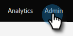

# En-têtes de page de destination {#landing-page-headers}

Suivez les étapes ci-dessous pour personnaliser certains des en-têtes HTTP sur vos domaines de page de destination.

1. Dans Marketo, cliquez sur **[!UICONTROL Admin]**.

   

1. Cliquez sur **[!UICONTROL Pages de destination]**.

   

1. Cliquez sur **[!UICONTROL Modifier]** en regard de En-têtes HTTP de page de destination.

   

1. Choisissez les paramètres souhaités et cliquez sur **[!UICONTROL Enregistrer]** lorsque vous avez terminé.

   

<table>
 <tr>
  <td><strong>[!UICONTROL Strict-Transport-Security]</strong></td>
  <td>Utilisez ceci pour garantir que les connexions aux landing pages seront toujours diffusées via HTTPS (ne doit être défini que pour les abonnements dont les landing pages sont sécurisées par SSL)</td>
 </tr>
 <tr>
  <td><strong>[!UICONTROL X-Frame-Options]</strong></td>
  <td>Permet de définir si les ressources hébergées par Marketo Engage peuvent être incorporées dans des pages web externes</td>
 </tr>
</table>

>[!CAUTION]
>
>Il est important de passer en revue ces paramètres avec votre équipe informatique afin de déterminer la stratégie de votre entreprise. Des paramètres incorrects peuvent empêcher certains visiteurs d’accéder à vos pages de destination.
