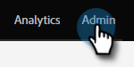

# En-têtes de page d’entrée {#landing-page-headers}

Suivez les étapes ci-dessous pour personnaliser certains en-têtes HTTP de vos domaines de page d’entrée.

1. Dans Marketo, cliquez sur **Administration**.

   

1. Cliquez sur **Pages de destination**.

   

1. Cliquez sur **Modifier** en regard des en-têtes HTTP de page d’entrée.

   

1. Sélectionnez les paramètres de votre choix, puis cliquez sur **Enregistrer** une fois terminé.

   

<table>
 <tr>
  <td><strong>Strict Transport-Security</strong></td>
  <td>Utilisez cette option pour garantir que les connexions aux landing pages seront toujours diffusées via HTTPS (ne doit être définie que pour les abonnements avec des landing pages sécurisées par SSL).</td>
 </tr>
 <tr>
  <td><strong>X-Frame-Options</strong></td>
  <td>Permet de définir si des ressources hébergées par des Marketo Engage peuvent être incorporées ou non dans des pages web externes.</td>
 </tr>
</table>

>[!CAUTION]
>
>Il est important de passer en revue ces paramètres avec votre équipe informatique afin de déterminer la stratégie de votre entreprise. Des paramètres incorrects peuvent empêcher certains visiteurs d’accéder à vos pages d’entrée.
