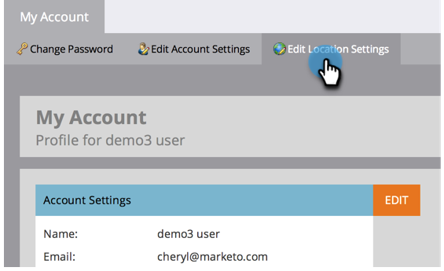

# Sélectionner votre langue, langue et fuseau horaire {#select-your-language-locale-and-time-zone}

L&#39;anglais n&#39;est pas votre première langue ? Ne t&#39;inquiète pas, nous t&#39;avons couvert. Voici comment modifier votre langue, vos paramètres régionaux et votre fuseau horaire.

## Langues prises en charge {#supported-languages}

* Anglais
* Français
* Allemand
* Japonais
* Portugais
* Espagnol

## Modification de la langue, de la langue et du fuseau horaire de l’utilisateur {#change-user-language-locale-and-time-zone}

1. Cliquez sur l&#39;icône **[!UICONTROL Admin]**.

   

1. Sélectionner **[!UICONTROL Mon compte]**.

   

1. Sous Mon compte, cliquez sur **[!UICONTROL Modifier les paramètres d’emplacement]**.

   

1. Modifiez votre **[!UICONTROL Langue]**.

   

   >[!TIP]
   >
   >Vous avez également la possibilité de modifier uniquement votre langue en cliquant sur la liste déroulante des langues en haut de la page de connexion.

1. Modifiez votre **[!UICONTROL Paramètres régionaux]**.

   

1. Modifiez votre **[!UICONTROL Fuseau horaire]**.

   

1. Cliquez sur **[!UICONTROL Enregistrer]**.

   

Beau boulot ! Votre navigateur s’actualise et les modifications sont répercutées.

