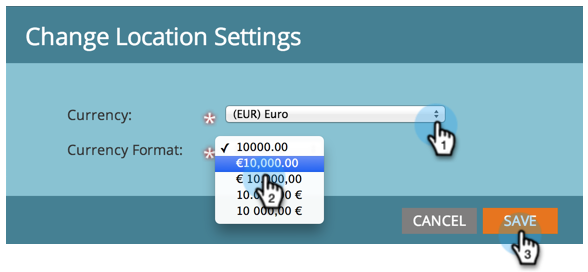

# Définir les paramètres d’emplacement par défaut pour un Abonnement {#set-default-location-settings-for-a-subscription}

Cet article décrit comment un administrateur peut vue et modifier les paramètres d’emplacement par défaut d’un abonnement, y compris la langue, les paramètres régionaux et le fuseau horaire.

>[!NOTE]
>
>Droits d’administration requis. La langue n’est généralement pas quelque chose que l’administrateur changerait. Il est spécifié au moment de l&#39;achat afin que l&#39;abonnement puisse être généré dans la langue appropriée.

## Définir les paramètres d’emplacement par défaut pour un Abonnement {#set-default-location-settings-for-a-subscription-1}

Lorsqu’un administrateur modifie les paramètres d’emplacement par défaut, les utilisateurs nouvellement créés héritent de ces paramètres. Les utilisateurs peuvent toujours [modifier leur langue, leurs paramètres régionaux et leurs préférences de fuseau horaire](/help/marketo/product-docs/administration/settings/select-your-language-locale-and-time-zone.md) dans leurs comptes individuels.

1. Sous **Admin**, cliquez sur **Emplacement**.

   

1. Cliquez sur **Modifier**.

   

   Cet abonnement a été créé en anglais. Supposons que vous étiez à Londres et que vous souhaitiez modifier la langue et le fuseau horaire par défaut. Le paramètre régional détermine la mise en forme des nombres, des dates et des heures.

1. Sélectionnez **Locale** et remplacez-le par **Anglais** (Royaume-Uni).

   

1. Enfin, choisissez le **Fuseau horaire** approprié.

   

   >[!NOTE]
   >
   >Marketo Sales Insight for [Salesforce.com](https://salesforce.com/) prend en charge le français, l’allemand, le japonais, le portugais et l’espagnol.

## Définir les paramètres de devise par défaut pour un Abonnement {#set-the-default-currency-settings-for-a-subscription}

Si vous modifiez les paramètres régionaux par défaut de vos utilisateurs, vous pouvez également modifier les paramètres de format de devise.

1. Cliquez sur **Modifier** dans Paramètres de devise de l’Abonnement.

   

1. Sélectionnez le format de devise de votre choix et cliquez sur **Enregistrer**.

   

   Félicitations ! Vous avez modifié les paramètres d’emplacement de l’abonnement.

>[!MORELIKETHIS]
>
>* [Sélectionner votre langue, langue et fuseau horaire](/help/marketo/product-docs/administration/settings/select-your-language-locale-and-time-zone.md)

