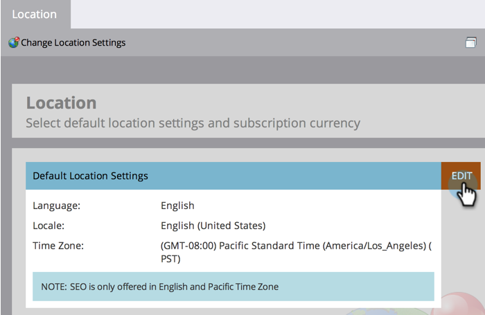

# Définition des paramètres de position par défaut pour un abonnement {#set-default-location-settings-for-a-subscription}

Cet article décrit comment un administrateur peut afficher et modifier les paramètres d’emplacement par défaut d’un abonnement, y compris la langue, les paramètres régionaux et le fuseau horaire.

>[!NOTE]
>
>Droits d’administrateur requis. La langue n’est généralement pas quelque chose que l’administrateur changerait. Il est précisé au moment de l&#39;achat afin que l&#39;abonnement puisse être généré dans la langue appropriée.

## Définition des paramètres de position par défaut pour un abonnement {#set-default-location-settings-for-a-subscription-1}

Lorsqu’un administrateur modifie les paramètres d’emplacement par défaut, les utilisateurs nouvellement créés héritent de ces paramètres. Les utilisateurs peuvent toujours [ modifier leur langue, leurs paramètres régionaux et leurs préférences de fuseau horaire ](/help/marketo/product-docs/administration/settings/select-your-language-locale-and-time-zone.md) dans leurs comptes individuels.

1. Accédez à la zone **[!UICONTROL Admin]**.

   

1. Cliquez sur **[!UICONTROL Location]**.

   

1. Cliquez sur **[!UICONTROL Modifier]**.

   

   Cet abonnement a été créé en anglais. Supposons que vous étiez à Londres et que vous souhaitiez changer le paramètre régional par défaut et le fuseau horaire. Le paramètre régional détermine le formatage des nombres, des dates et des heures.

1. Sélectionnez le **[!UICONTROL Paramètre régional]** et remplacez-le par **[!UICONTROL Anglais (Royaume-Uni)]**.

   

1. Enfin, choisissez le **[!UICONTROL Fuseau horaire]** approprié.

   

   >[!NOTE]
   >
   >Marketo Sales Insight for [Salesforce.com](https://salesforce.com/) prend en charge l’allemand, le français, le japonais, le portugais et l’espagnol.

## Définition des paramètres de devise par défaut d’un abonnement {#set-the-default-currency-settings-for-a-subscription}

Si vous modifiez les paramètres régionaux par défaut pour vos utilisateurs, vous pouvez également modifier les paramètres de format de devise.

1. Cliquez sur **[!UICONTROL Modifier]** dans [!UICONTROL &#x200B; Paramètres de devise d’abonnement &#x200B;].

   

1. Sélectionnez le format de devise de votre choix et cliquez sur **[!UICONTROL Enregistrer]**.

   

   Félicitations ! Vous avez modifié les paramètres de votre emplacement pour l’abonnement.

>[!MORELIKETHIS]
>
>* [Sélectionner votre langue, langue et fuseau horaire](/help/marketo/product-docs/administration/settings/select-your-language-locale-and-time-zone.md)
