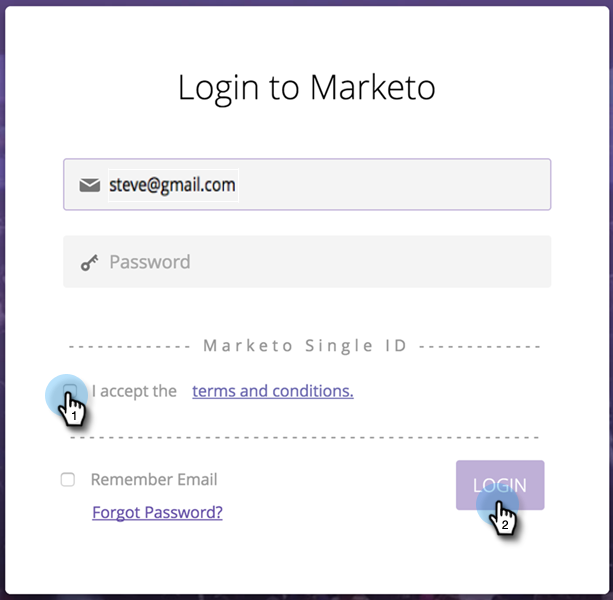

# Utilisation d’un identifiant universel pour la connexion à l’abonnement {#using-a-universal-id-for-subscription-login}

Un identifiant universel vous permet d’accéder à plusieurs abonnements Marketo avec une seule connexion et de passer rapidement d’un abonnement à l’autre. Cependant, vous pouvez utiliser différentes connexions pour vos abonnements si vous le souhaitez.

Avec Universal ID, vous créez toujours des tickets d’assistance pour chacun de vos abonnements individuels.

Les paramètres de niveau d’abonnement sont respectés pour les utilisateurs qui utilisent l’ID universel, par exemple les rôles, les autorisations et les politiques de mot de passe. Les modifications apportées au niveau du profil utilisateur sont répercutées dans tous les abonnements, par exemple, prénom, nom et adresse e-mail.

## Configuration d’un Universal ID {#setting-up-a-universal-id}

Tous les abonnements Marketo sont fournis avec la fonctionnalité d’identifiant universel en option. À partir de chaque instance individuelle, votre administrateur Marketo doit vous inviter à chacun de vos abonnements différents avec la même connexion. Marketo ne peut pas fusionner automatiquement vos identifiants existants.

>[!NOTE]
>
>Si vous disposez de plusieurs identifiants de connexion d’abonnement, vous pouvez également disposer de plusieurs profils de communauté. Veillez à choisir l’identifiant de votre Universal ID connecté au profil que vous souhaitez utiliser, et il correspond à votre instance de production, et non à votre sandbox.

## Connexion {#logging-in}

Lorsque vous vous connectez pour accepter une invitation à un deuxième abonnement à l&#39;aide d&#39;un identifiant universel, la page de connexion Opt-in s&#39;affiche. Vous devez cocher une case pour accepter les conditions générales. Une fois que vous avez accepté, la page de réinitialisation normale s&#39;affiche, pas celle-ci, pour toutes les connexions suivantes. En acceptant les conditions générales, vous autorisez Marketo à distribuer vos données de profil de base (telles que le prénom, le nom et l’adresse e-mail) aux centres de données dans différents emplacements où votre abonnement est hébergé.

>[!TIP]
>
>Les identifiants que vous n’utilisez plus restent sauf si l’administrateur de l’abonnement les supprime. Nous vous recommandons de les conserver au cas où, par exemple, vous auriez un rapport privé qui vous serait attribué et auquel vous ne pourriez accéder qu’à l’aide de cet identifiant. Dans ce cas, il est logique de déplacer ces rapports privés vers votre nouvel identifiant universel, puis de supprimer votre identifiant existant.

## Mots de passe {#passwords}

Avec l’Universal ID pour plusieurs abonnements, Marketo applique automatiquement la politique de mot de passe la plus stricte. Par exemple, si certains abonnements nécessitent une longueur de mot de passe minimale et d’autres non, la longueur minimale sera appliquée à tous les abonnements.

Avec un Universal ID pour plusieurs abonnements, vous seul pouvez modifier le mot de passe.

>[!NOTE]
>
>Marketo demandera aux utilisateurs qui souhaitent utiliser l’Universal ID de réinitialiser leur mot de passe si le mot de passe de l’abonnement actuel n’est pas conforme à la politique de mot de passe du deuxième abonnement auquel ils sont invités.

## Basculer entre les abonnements {#switching-between-subscriptions}

Grâce à un identifiant universel, vous pouvez voir l’abonnement auquel vous êtes connecté et sélectionner d’autres abonnements auxquels vous avez accès. Dans la plupart des cas, vous pouvez passer d’un service à l’autre sans avoir à vous déconnecter ni à vous reconnecter.

Si les options [Authentification unique](/help/marketo/product-docs/administration/additional-integrations/add-single-sign-on-to-a-portal.md) et ID universel sont activées, l’autorisation « Contourner l’authentification unique » doit être définie pour basculer entre les abonnements.

Lorsque vous vous déconnectez puis vous reconnectez, Marketo vous connecte automatiquement à l’abonnement auquel vous vous êtes connecté pour la dernière fois. Vous pouvez ensuite passer à un autre abonnement si nécessaire.

## Profils de communauté {#community-profiles}

Si vous disposez de plusieurs abonnements, vous pouvez avoir plusieurs profils de communauté. Nous vous recommandons de choisir l’identifiant associé à votre profil de communauté le plus actif.

>[!MORELIKETHIS]
>
>* [Ajouter l&#39;authentification SSO à un portail](/help/marketo/product-docs/administration/additional-integrations/add-single-sign-on-to-a-portal.md){target="_blank"}
>* [Restreindre la connexion utilisateur à l&#39;authentification unique uniquement](/help/marketo/product-docs/administration/additional-integrations/restrict-user-login-to-sso-only.md){target="_blank"}
>* [Invitation d’utilisateurs Marketo à deux instances avec un ID universel](https://nation.marketo.com/t5/Knowledgebase/Inviting-Marketo-Users-to-Two-Instances-with-Universal-ID-UID/ta-p/251122){target="_blank"}
