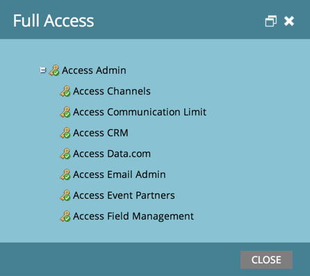

# Découvrir les autorisations dont vous disposez. {#find-out-what-permissions-you-have}

Si vous vous demandez quelles autorisations vous avez ou n’avez pas dans Marketo, il existe un moyen facile de le savoir.

1. Accédez à **[!UICONTROL Activités marketing]**.

   

1. Cliquez sur **[!UICONTROL Accès complet]** pour afficher les autorisations dont vous disposez.

   

Les autorisations sont alors répertoriées.

Si vous avez besoin de l’une des autorisations activées pour vous, contactez votre administrateur Marketo.
