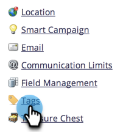
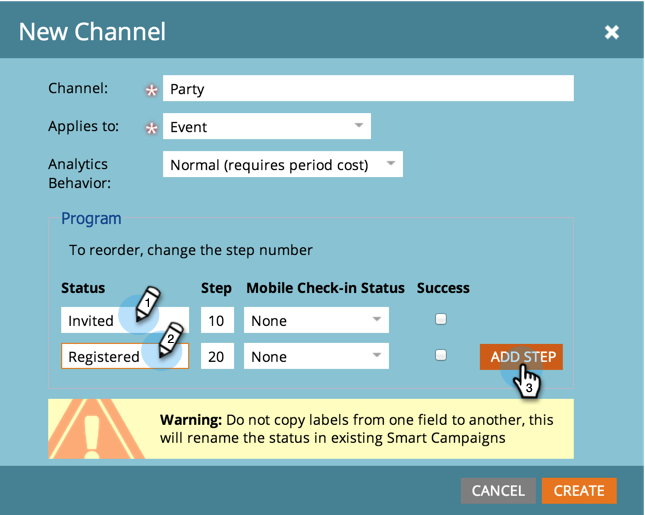

# Créer un canal de programme {#create-a-program-channel}

Un programme est une initiative marketing spécifique. Le canal est conçu pour être le mécanisme de diffusion, comme un webinaire, un parrainage ou une publicité en ligne.

>[!NOTE]
>
>**Autorisations d’administration requises**

>[!NOTE]
>
>En savoir plus sur [programmes](/help/marketo/product-docs/core-marketo-concepts/programs/creating-programs/understanding-programs.md), l’élément le plus important de Marketo.

1. Accédez à la zone **[!UICONTROL Admin]**.

   

1. Cliquez sur **[!UICONTROL Balises]**.

   

   >[!NOTE]
   >
   >Pourquoi les balises ? Un canal est une façon de décrire un programme, tout comme d’autres balises. Le canal a des caractéristiques spéciales supplémentaires.

1. Cliquez sur le signe **+** en regard de [!UICONTROL Canal] pour développer et afficher les canaux existants.

   

1. Sous **[!UICONTROL Nouveau]**, cliquez sur **[!UICONTROL Nouveau canal]**.

   

   >[!NOTE]
   >
   >**Exemple**
   >
   >Canal : Billboard
   >
   >* Appliquer à : par défaut
   >* Progression : Membre, Engagé (ces valeurs par défaut sont appropriées)
   >* Succès : Engagé
   >
   >Canal : Fête
   >
   >* Appliquer à : Événement
   >* Progression : Invité, Inscrit, Pas d’affichage et Participants
   >* Succès : Terminé
   >
   >Consultez la section Progression des canaux existants pour obtenir des conseils sur la manière de les utiliser.

1. En prenant comme exemple le canal du tiers, nommez votre nouveau **[!UICONTROL canal]** et sélectionnez le type de programme auquel il s’appliquera.

   

   >[!NOTE]
   >
   >Il existe plusieurs types de programmes. Faites correspondre le canal au type approprié. En cas de doute, choisissez **[!UICONTROL Par défaut]**.

   >[!NOTE]
   >
   >Lors de l’utilisation de « [!UICONTROL Événement avec webinaire] », les mappages système sont verrouillés (comme l’exigent les intégrations de webinaires) et ne peuvent pas être modifiés.

1. Saisissez les deux premiers noms de statut du programme, puis cliquez sur **[!UICONTROL Ajouter une étape]**.

   

1. Saisissez un autre numéro de programme **[!UICONTROL Statut]** et **[!UICONTROL Étape]**, puis cliquez sur **[!UICONTROL Ajouter une étape]**.

   

   >[!TIP]
   >
   >Le numéro **[!UICONTROL Step]** est utilisé pour trier les statuts de programme. Notez que les personnes ne peuvent pas revenir en arrière dans ces étapes de progression. Ils peuvent uniquement changer de statut pour un statut supérieur ou égal à la valeur . Utilisez les valeurs égales lorsque les statuts sont destinés à basculer d’avant en arrière plutôt qu’à une progression.

1. Saisissez le dernier numéro de programme **[!UICONTROL Statut]** et **[!UICONTROL Étape]**.

   

   >[!NOTE]
   >
   >Lors de l’utilisation du type « [!UICONTROL Événement] », le mappage système pour les statuts Enregistré, Sur liste d’attente et Avec participation est obligatoire. Par conséquent, ces statuts ne peuvent pas être masqués.

1. Sélectionnez le **[!UICONTROL Statut d’enregistrement mobile]** pour **[!UICONTROL Enregistré]**.

   

1. Sélectionnez le **[!UICONTROL Statut de l’enregistrement mobile]** pour **[!UICONTROL Terminé]**.

   

   >[!NOTE]
   >
   >Les options **[!UICONTROL Statut d’enregistrement mobile]** ne seront disponibles que si le canal est réservé à des programmes d’événement.

   >[!NOTE]
   >
   >Seules les personnes dont le **[!UICONTROL statut d’enregistrement mobile]** est défini sur **[!UICONTROL Enregistré]** et **[!UICONTROL Terminé]** seront visibles dans les [applications d’enregistrement mobile](/help/marketo/product-docs/core-marketo-concepts/mobile-apps/event-check-in/event-check-in-overview.md).

   >[!TIP]
   >
   >Si une nouvelle personne est créée dans l’application d’enregistrement mobile, elle est définie sur [!UICONTROL Enregistrée] dans le programme d’événement. Si une personne est archivée dans l’événement sur l’application, celui-ci est défini sur [!UICONTROL Participé] dans le programme de l’événement.

1. Sélectionnez le statut du programme **[!UICONTROL Succès]**, puis cliquez sur **[!UICONTROL Créer]**.

   

   Lorsque vous faites une nouvelle émission de ce type, ce nouveau canal sera l&#39;un des choix.
