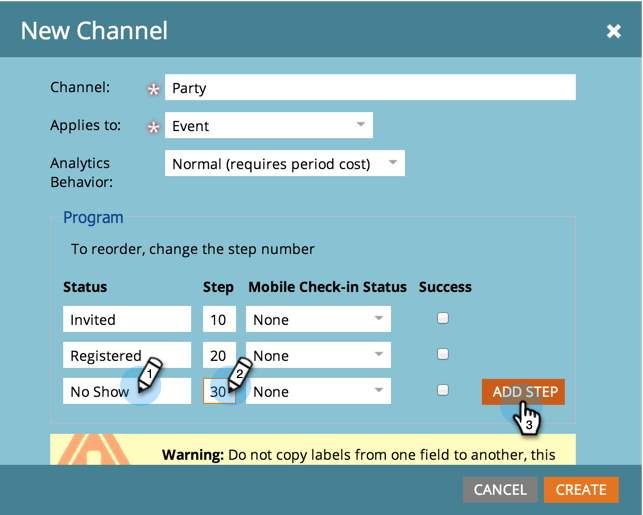

# Création d’un canal de programme {#create-a-program-channel}

Un programme est une initiative marketing spécifique. Le canal est conçu pour être le mécanisme de diffusion, comme le webinaire, le parrainage ou la publicité en ligne.

>[!NOTE]
>
>**Autorisations d’administrateur requises**

>[!NOTE]
>
>En savoir plus sur [programmes](/help/marketo/product-docs/core-marketo-concepts/programs/creating-programs/understanding-programs.md), l’élément le plus important de Marketo.

1. Cliquez sur l&#39;icône **Admin**.

   

1. Cliquez sur **Balises**.

   

   >[!NOTE]
   >
   >Pourquoi les balises ? Un canal est une manière de décrire un programme, tout comme les autres balises. Le canal a juste des fonctionnalités supplémentaires spéciales.

1. Cliquez sur le bouton **+** signe en regard de **Canal** pour développer et afficher les canaux existants.

   

1. Sous **Nouveau**, cliquez sur **Nouveau canal**.

   

   >[!NOTE]
   >
   >**Exemple**
   >
   >Canal : Panneau
   >
   >* Appliquer à : Par défaut
   >* Progression : Membre, engagé (en cas de doute, cela fonctionne bien)
   >* Succès : Engagé

   >
   >Canal : Parti
   >
   >* Appliquer à : Événement
   >* Progression : Invités, enregistrés, aucun affichage et participants
   >* Succès : Attaché

   >
   >Consultez la section Progressions des canaux existants pour savoir comment les utiliser.

1. Examinons l’exemple du canal Parti. Nommez votre nouveau **Canal** et sélectionnez le type de programme auquel il s&#39;appliquera.

   

   >[!NOTE]
   >
   >Appliquer à quoi ? Il existe plusieurs types de programmes. Faites correspondre le canal au type approprié. En cas de doute, choisissez **Par défaut**.

   >[!NOTE]
   >
   >Lors de l’utilisation de &quot;Événement avec webinaire&quot;, les mappages système sont verrouillés (comme requis par les intégrations de webinaires) et ne peuvent pas être modifiés.

1. Saisissez les deux premiers noms d’état du programme, puis cliquez sur **Ajouter une étape**.

   

1. Entrer un autre programme **État** et **Étape** number, puis cliquez sur **Ajouter une étape**.

   

   >[!TIP]
   >
   >Le **Étape** est utilisé pour trier les états du programme. Gardez à l’esprit que les gens ne peuvent pas revenir en arrière dans ces étapes de progression. Ils peuvent uniquement modifier l’état à un état de valeur supérieur ou égal. Utilisez les valeurs égales lorsque les états sont destinés à basculer d’un état à l’autre plutôt qu’à une progression.

1. Entrer le dernier programme **État** et **Étape** Nombre.

   

   >[!NOTE]
   >
   >Lors de l’utilisation du type &quot;Événement&quot;, le mappage système pour les états Registered, Waitlisted et Attending est requis. Ces états ne peuvent donc pas être masqués.

1. Sélectionnez la variable **État de l’archivage mobile** pour **Inscrits**.

   

1. Sélectionnez la variable **État de l’archivage mobile** pour **Attaché**.

   

   >[!NOTE]
   >
   >**État de l’archivage mobile**** ** options ne seront disponibles que si le canal sera destiné aux programmes d’événement.

   >[!NOTE]
   >
   >Uniquement les personnes avec un **État de l’archivage mobile** de **Inscrits** et **Attaché** est visible dans la variable [Applications d’archivage mobiles](/help/marketo/product-docs/core-marketo-concepts/mobile-apps/event-check-in/event-check-in-overview.md).

   >[!TIP]
   >
   >Si une nouvelle personne est créée dans l’application d’enregistrement mobile, elle est définie sur Inscrits dans le programme d’événement. Si une personne est archivée dans l’événement de l’application, elle est définie sur Participé dans le programme d’événements.

1. Sélectionnez la **Succès** état du programme, puis cliquez sur **Créer**.

   

   C&#39;est joli ! Lorsque vous créez un nouveau programme de ce type, ce nouveau canal sera l’un des choix.
