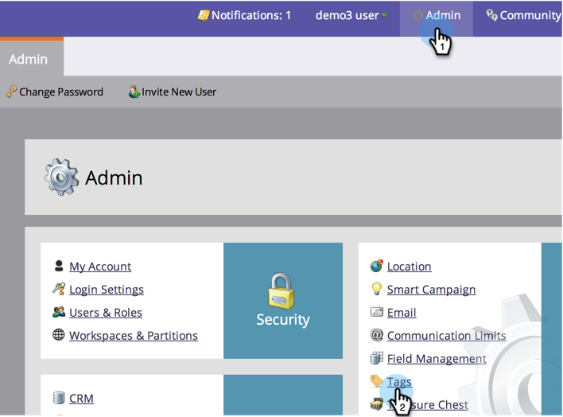
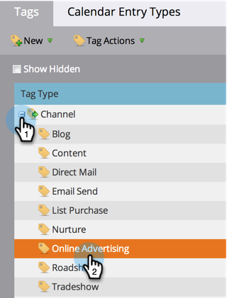

# Masquer/afficher un Canal de Programme {#hide-unhide-a-program-channel}

>[!NOTE]
>
>**Autorisations d’administrateur requises**

Vous pouvez [supprimer un canal de programme](/help/marketo/product-docs/administration/tags/delete-a-program-channel.md) s&#39;il n&#39;est utilisé par aucun programme.  Cependant, une fois qu&#39;elle est utilisée, nous devons la garder autour de nous.  Vous pouvez toutefois le masquer si vous n’en avez plus besoin.

## Masquer un Canal de Programme {#hide-a-program-channel}

1. Sous **Admin**, cliquez sur **Balises**.

   

1. Cliquez sur la liste déroulante **Canal** et sélectionnez le **Canal** à masquer.

   

1. Sous **Actions de balise**, cliquez sur **Masquer**.

   

Allez, allez-y !

## Afficher un Canal de Programme {#unhide-a-program-channel}

1. Affichez un Canal de Programme en cochant la case Afficher masqué.

   

