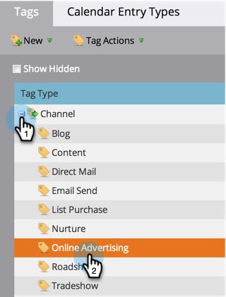
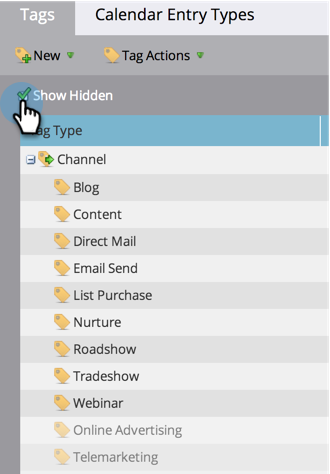

# Masquer/afficher un canal de programme {#hide-unhide-a-program-channel}

>[!NOTE]
>
>**Autorisations d’administration requises**

Vous pouvez [supprimer un canal de programme](/help/marketo/product-docs/administration/tags/delete-a-program-channel.md) s’il n’est utilisé par aucun programme.  Cependant, une fois qu’il est utilisé, il doit rester dans le système. Vous pouvez le cacher si vous n&#39;en avez plus besoin.

## Masquer un canal de programme {#hide-a-program-channel}

1. Accédez à la zone **[!UICONTROL Admin]**.

   

1. Cliquez sur **[!UICONTROL Balises]**.

   

1. Cliquez sur la liste déroulante **[!UICONTROL Canal]** et sélectionnez le **[!UICONTROL Canal]** à masquer.

   

1. Sous **[!UICONTROL Actions de balise]**, cliquez sur **[!UICONTROL Masquer]**.

   

## Afficher un canal de programme {#unhide-a-program-channel}

1. Affichez un canal de programme en cochant la case **[!UICONTROL Afficher masqué]**.

   
