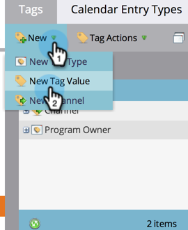

# Gestion des valeurs de balises {#managing-tag-values}

Les [balises](/help/marketo/product-docs/core-marketo-concepts/programs/working-with-programs/understanding-tags.md) sont utilisées pour décrire les programmes. Vous pouvez en faire autant que nécessaire, chacun avec des valeurs uniques. Voici comment gérer ces valeurs.

>[!NOTE]
>
>**Autorisations d’administrateur requises**

>[!PREREQUISITES]
>
>[Créer une balise de programme et des valeurs de balise](/help/marketo/product-docs/administration/tags/create-a-new-program-tag-and-tag-values.md)

## Ajout de valeurs de balise {#adding-tag-values}

1. Accédez à la zone **[!UICONTROL Admin]**.

   

1. Cliquez sur **[!UICONTROL Balises]**.

   

1. Cliquez sur **[!UICONTROL Nouveau]**, puis sur **[!UICONTROL Nouvelle valeur de balise]**.

   

1. Sélectionnez le **[!UICONTROL Type de balise]**.

   

1. Saisissez une **[!UICONTROL Valeur]** puis cliquez sur **[!UICONTROL Ajouter autre]**. Vous pouvez ajouter autant de valeurs que vous le souhaitez.

   

1. Ajoutez les valeurs restantes et cliquez sur **[!UICONTROL Créer]**.

   

Les modifications devraient s’afficher immédiatement.

## Masquage des valeurs de balise {#hiding-tag-values}

Les balises peuvent être utilisées par d’anciens programmes. Vous pouvez les rendre obsolètes pour une utilisation ultérieure en masquant le type de balise.

1. Sélectionnez la **[!UICONTROL Balise]** puis la **[!UICONTROL Valeur]** à masquer.

   

1. Sous **[!UICONTROL Actions de balise]**, sélectionnez **[!UICONTROL Masquer]**.

   

## Afficher les valeurs masquées {#show-hidden-values}

Pour afficher à nouveau vos valeurs masquées, procédez comme suit :

1. Cochez la case **[!UICONTROL Afficher les éléments masqués]**. Une fois cette case cochée, la valeur masquée s’affiche.

   

Vous pouvez ensuite afficher les valeurs que vous souhaitez utiliser à l’avenir.
