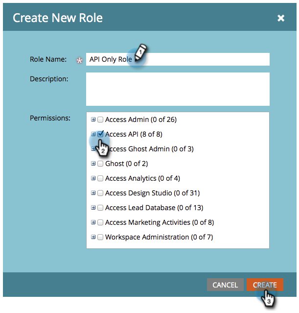

# Création d’un rôle d’utilisateur API uniquement {#create-an-api-only-user-role}

Si vous souhaitez intégrer Marketo par le biais de l’ [API REST](https://experienceleague.adobe.com/en/docs/marketo-developer/marketo/rest/rest-api), la bonne pratique consiste à [ attribuer à un utilisateur le rôle API uniquement](/help/marketo/product-docs/administration/users-and-roles/create-an-api-only-user.md), puis à [ créer un service personnalisé à utiliser avec l’API REST](/help/marketo/product-docs/administration/additional-integrations/create-a-custom-service-for-use-with-rest-api.md). Voici comment créer le rôle d’utilisateur de l’API uniquement.

>[!NOTE]
>
>**Autorisations d’administrateur requises**

1. Accédez à la zone **[!UICONTROL Admin]**.

   

1. Cliquez sur **[!UICONTROL Utilisateurs et rôles]**.

   

1. Cliquez sur l’onglet **[!UICONTROL Rôles]** , puis sur **[!UICONTROL Nouveau rôle]**.

   

1. Saisissez un nom de rôle, sélectionnez les autorisations d’accès à l’API que vous souhaitez attribuer, puis cliquez sur **[!UICONTROL Créer]**.

   

>[!TIP]
>
>Il est toujours préférable de n’accorder que les autorisations minimales requises.

>[!MORELIKETHIS]
>
>D&#39;accord, bien joué ! Maintenant [, créons une API uniquement utilisateur](/help/marketo/product-docs/administration/users-and-roles/create-an-api-only-user.md).
