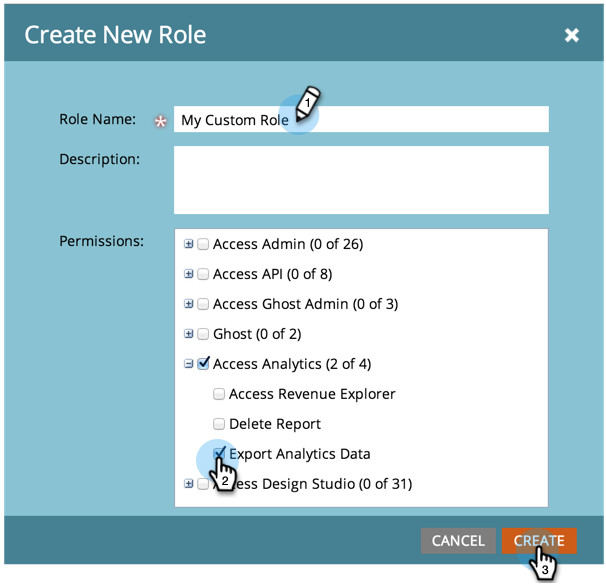
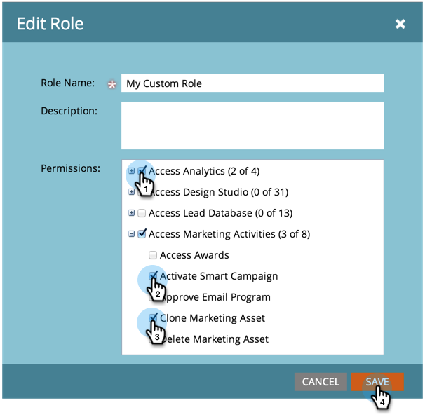
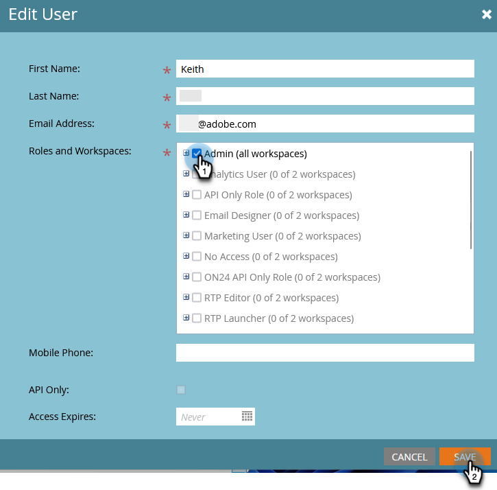

# Créer, supprimer, modifier et remplacer un rôle d’utilisateur ou d’utilisatrice {#create-delete-edit-and-change-a-user-role}

**Rôles** regroupez un ensemble d’autorisations. **Autorisations** vous permettent d’effectuer des actions dans Marketo. Vous attribuez un **rôle** à un utilisateur.

>[!NOTE]
>
>**Autorisations d’administration requises**

>[!IMPORTANT]
>
>Les rôles suivants sont des rôles système et ne peuvent pas être supprimés :
>
>* Administration
>* Administrateur de produits Adobe

## Créer un rôle {#create-a-role}

1. Accédez à la zone **[!UICONTROL Admin]**.

   

1. Cliquez sur **[!UICONTROL Utilisateurs et rôles]**.

   

1. Accédez à l’onglet **[!UICONTROL Rôles]** et cliquez sur **[!UICONTROL Nouveau rôle]**.

   

1. Nommez votre nouveau rôle, vérifiez toutes les autorisations que vous souhaitez accorder aux utilisateurs associés au rôle, puis cliquez sur **[!UICONTROL Créer]**.

   

## Supprimer un rôle {#delete-a-role}

1. Accédez à la zone **[!UICONTROL Admin]**.

   

1. Cliquez sur **[!UICONTROL Utilisateurs et rôles]**.

   

1. Sous l’onglet **[!UICONTROL Rôles]**, sélectionnez un rôle et cliquez sur **[!UICONTROL Supprimer un rôle]**.

   

1. Confirmez la suppression en cliquant sur **[!UICONTROL Supprimer]**.

   

>[!NOTE]
>
>Vous devez d’abord vous assurer qu’aucun utilisateur n’est affecté à un rôle, sinon il ne peut pas être supprimé.

## Modifier un rôle existant {#edit-an-existing-role}

>[!NOTE]
>
>Pour modifier votre propre rôle d’utilisateur, vous devez vous connecter en tant qu’autre utilisateur avec des droits d’administrateur.

1. Accédez à la zone **[!UICONTROL Admin]**.

   

1. Cliquez sur **[!UICONTROL Utilisateurs et rôles]**.

   

1. Cliquez sur l’onglet **[!UICONTROL Rôles]**.

   

1. Sélectionnez le rôle à modifier, puis cliquez sur **[!UICONTROL Modifier le rôle]**.

   

1. Apportez toutes les modifications nécessaires, puis cliquez sur **[!UICONTROL Enregistrer]**.

   

   >[!NOTE]
   >
   >Les modifications apportées au rôle affecteront chaque utilisateur associé à ce rôle.

## Modifier le rôle d’un utilisateur {#change-a-users-role}

1. Accédez à la zone **[!UICONTROL Admin]**.

   

1. Cliquez sur **[!UICONTROL Utilisateurs et rôles]**.

   

1. Sélectionnez l’utilisateur auquel vous souhaitez affecter un autre rôle, puis cliquez sur **[!UICONTROL Modifier l’utilisateur]**.

   

1. Décochez le rôle précédent, sélectionnez le nouveau, puis cliquez sur **[!UICONTROL Enregistrer]**.

   

>[!NOTE]
>
>Si vous laissez plusieurs rôles sélectionnés, Marketo utilisera par défaut l’autorisation la plus restrictive.
