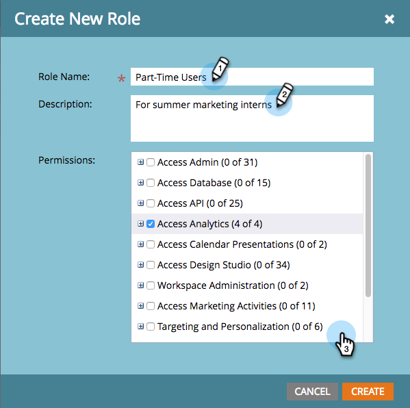

# Descriptions des autorisations de rôle {#descriptions-of-role-permissions}

Vous trouverez ci-dessous une liste de toutes les autorisations disponibles que vous pouvez affecter à vos rôles. Les autorisations sont généralement associées à des zones fonctionnelles spécifiques dans Marketo et peuvent vous aider à contrôler les zones et fonctionnalités auxquelles différents utilisateurs ont accès.

Informations supplémentaires sur les autorisations :

* L’autorisation &quot;Accès&quot; permet à un rôle d’afficher et parfois de modifier cette partie de l’application.
* Pour qu’un rôle ait accès aux sous-autorisations (&quot;Créer&quot;, &quot;Supprimer&quot;, etc.), il doit disposer de l’autorisation &quot;Accès&quot; à cette partie de l’application. Par exemple, si vous souhaitez autoriser une personne à modifier les campagnes, elle doit disposer d’une autorisation globale d’accès aux activités marketing.
* Vous pouvez peut-être voir des actions ou des ressources que vous n’êtes pas autorisé à utiliser. Cependant, si vous tentez d’y accéder, un message vous avertit de votre accès limité.

## Autorisations disponibles {#available-permissions}

Lorsque vous [créez ou modifiez un rôle](/help/marketo/product-docs/administration/users-and-roles/managing-user-roles-and-permissions.md), vous pouvez sélectionner l’une des autorisations suivantes pour autoriser ce rôle en cochant les cases appropriées.

## Accès administrateur  {#access-admin}

Affichez et apportez des modifications aux paramètres dans la section Mon compte de l’administrateur.

* Accès à Adobe Connect : permet aux utilisateurs d’accéder à l’écran Adobe Connect.
* Accès à Adobe Experience Manager&#42; - Donne aux utilisateurs l’accès à l’écran Adobe Experience Manager
* Accès au mappage de l’organisation Adobe&#42; - Donne aux utilisateurs l’accès à l’écran de mappage de l’organisation Adobe
* Accéder au journal d’audit de l’administrateur &#42; : permet aux utilisateurs d’accéder à l’écran Journal d’audit d’administration
* Accéder au journal d’audit d’accès &#42; - Donne aux utilisateurs l’accès au journal d’audit d’accès
* Accéder au journal d’audit : permet aux utilisateurs d’accéder au journal d’audit des ressources et au journal d’audit de l’administrateur.
* Accès à CAPTCHA - Accès à l’écran CAPTCHA
* Accès aux canaux : permet aux utilisateurs d’accéder uniquement à la balise Channel et non à d’autres balises personnalisées.
* Limite de communication d’accès : permet aux utilisateurs d’activer une limite de communication dans Admin
* Accès à la gestion de la relation client : permet aux utilisateurs d’accéder à la gestion de la relation client, comme [!DNL Salesforce] ou [!DNL Microsoft Dynamics], dans Admin.
* Accéder à [[!DNL Data.com]](https://data.com) - Donne aux utilisateurs l’accès à l’action de flux Data.com
* Accès à l’administrateur des courriers électroniques : permet aux utilisateurs d’accéder à l’administrateur des courriers électroniques pour modifier les paramètres par défaut, tels que le désabonnement et les domaines de marque.
* Accès aux partenaires d’événement : permet aux utilisateurs d’accéder à LaunchPoint dans Admin.
* Gestion des champs d’accès : permet aux utilisateurs d’accéder à la gestion des champs dans Admin.
* Accéder au téléchargement de fichier : permet aux utilisateurs de charger des images et des fichiers dans Design Studio.
* Accès aux pages d’entrée : permet aux utilisateurs d’accéder aux pages d’entrée dans Admin.
* Emplacement d’accès : permet aux utilisateurs d’accéder à l’emplacement dans l’administration pour définir la langue, le paramètre régional, le fuseau horaire et la devise par défaut.
* Historique de connexion des accès : permet aux utilisateurs d’accéder à l’historique de connexion des utilisateurs dans le journal d’audit
* Paramètres de connexion d’accès : permet aux utilisateurs d’accéder aux paramètres de connexion dans les paramètres Administration pour la sécurité, les restrictions d’IP et les rapports de liste dynamique.
* Accès à la nouvelle expérience&#42; - Donne aux utilisateurs l’accès à l’écran Nouvelle expérience.
* Accès à l’activité personnalisée Marketo - Donne aux utilisateurs l’accès aux activités personnalisées Marketo dans Admin
* Accès à l’objet personnalisé de Marketo - Donne aux utilisateurs l’accès aux objets personnalisés de Marketo dans Admin
* Accès à [!DNL Munchkin] - Les utilisateurs GI ont accès à [!DNL Munchkin] dans Admin pour définir le code de suivi, le suivi des personnes et activer la configuration de l’API.
* Accès aux audiences prédictives&#42; - Donne aux utilisateurs l’accès à l’écran des audiences prédictives
* Accès à Revenue Cycle Analytics : permet aux utilisateurs d’accéder à Revenue Cycle Analytics dans l’administration pour définir le résumé de synchronisation et l’attribution.
* Rôles d’accès : permet aux utilisateurs de gérer et de modifier des rôles, mais pas aux utilisateurs.
* Accès à Sales Insight : permet aux utilisateurs de gérer Sales Insight dans Admin pour définir l’état, la configuration de l’API, la notation des personnes et d’autres paramètres.
* Connexion unique : permet aux utilisateurs de gérer l’authentification unique dans Admin pour activer SAML et utiliser les paramètres SAML et les URL de page de redirection.
* Accéder à la campagne dynamique : permet aux utilisateurs d’accéder à la campagne dynamique dans l’administration pour limiter les limitations sur les personnes qualifiées.
* Accès à SOAP API : donne aux utilisateurs l’accès à la gestion des API SOAP dans les services web dans Admin.
* Accéder aux balises : permet aux utilisateurs d’accéder à toutes les balises personnalisées, à l’exception de la balise Canal.
* Accéder à la poitrine au trésor : donne aux utilisateurs accès aux fonctionnalités expérimentales de la poitrine au trésor dans l’administration
* Accès aux utilisateurs : donne aux utilisateurs l’accès à la modification et à la gestion des utilisateurs (mais pas aux rôles) dans l’administration.
* Accès aux webhooks : permet aux utilisateurs de se connecter aux webhooks dans Admin pour définir les détails et les mappages de réponse.
* Accéder aux espaces de travail et aux partitions : permet aux utilisateurs de créer, modifier et supprimer des espaces de travail et des partitions dans Admin.

_&#42;Pour éviter toute interruption pour les utilisateurs existants, cette autorisation est introduite en mode passif et est visible, mais pas accessible pour le moment. Nous vous indiquerons comment l’implémenter lorsqu’elle sera active à la mi-2024._

## Accéder à l’API  {#access-api}

Donne aux utilisateurs disposant de l’**API Only** **Rôle** l’accès aux API individuelles répertoriées ci-dessous.

* Approuver les ressources
* Lancer la campagne
* Activité en lecture seule
* Métadonnées d’activité en lecture seule
* Ressources en lecture seule
* Campagne en lecture seule
* Société en lecture seule
* Objet personnalisé en lecture seule
* Individu en lecture seule
* Compte nommé en lecture seule
* Opportunité en lecture seule
* Commercial en lecture seule
* Activité en lecture/écriture
* Métadonnées d’activité en lecture/écriture
* Ressources accessibles en lecture/écriture
* Campagne accessible en lecture/écriture
* Société accessible en lecture/écriture
* Objet personnalisé accessible en lecture/écriture
* Individu accessible en lecture / écriture
* Compte nommé en lecture / écriture
* Opportunité accessible en lecture/écriture
* Commercial accessible en lecture/écriture

## Accès Analytics {#access-analytics}

Donne aux utilisateurs l’accès aux onglets Analytics, aux statistiques sur les e-mails, aux rapports et aux trois éléments ci-dessous, sauf s’ils ne sont pas cochés.

* Accéder à l’Explorateur des recettes : la désactivation supprime l’accès de l’utilisateur à l’Explorateur des recettes.
* Créer un rapport&#42; - Permet aux utilisateurs d’accéder à la création, au clonage, à la lecture, à la mise à jour et au déplacement des ressources du rapport dans Analytics et les activités marketing, ainsi que dans les ressources Modeler de Recettes Cycle
* Supprimer le rapport : la désélection supprime la possibilité pour l’utilisateur de supprimer des rapports.
* Exportation des données Analytics : la désélection supprime la possibilité pour l’utilisateur d’exporter des données Analytics.

_&#42;Pour éviter toute interruption pour les utilisateurs existants, cette autorisation est introduite en mode passif et est visible, mais pas accessible pour le moment. Nous vous indiquerons comment l’implémenter lorsqu’elle sera active à la mi-2024._

## Accéder aux présentations du calendrier {#access-calendar-presentations}

Donne aux utilisateurs l’accès aux présentations du calendrier : permet d’afficher le bouton Presentations en bas de la page.

* Modifier le calendrier Presentations : permet aux utilisateurs de modifier des présentations dans le calendrier

## Accès au studio de conception {#access-design-studio}

Permet aux utilisateurs d’accéder à l’onglet Design Studio et à la vue de l’arborescence, mais pas aux détails.

* Accès aux e-mails
   * Modifier le courrier électronique : permet aux utilisateurs de modifier, créer et cloner des courriers électroniques.
      * Rendre le message électronique opérationnel : permet aux utilisateurs de rendre un message électronique opérationnel. Voir : [Rendre un courrier électronique opérationnel](/help/marketo/product-docs/email-marketing/general/functions-in-the-editor/make-an-email-operational.md)

      * Valider le courrier électronique : permet aux utilisateurs d’approuver les courriers électroniques.
      * Supprimer le courrier électronique : permet aux utilisateurs de supprimer des courriers électroniques.
      * Définir un domaine de marque : permet aux utilisateurs de travailler avec des domaines de marque. Voir : [Ajouter un domaine de marque supplémentaire](/help/marketo/product-docs/administration/email-setup/add-multiple-branding-domains/add-an-additional-branding-domain.md)

* Accès au modèle d&#39;e-mail

   * Approuver le modèle d&#39;e-mail
   * Supprimer le modèle d&#39;e-mail
   * Modifier le modèle de courrier électronique : modifiez, créez et clonez des modèles de courrier électronique.

* Accès au formulaire

   * Approuver le formulaire
   * Supprimer le formulaire
   * Modifier le formulaire : modifiez, créez et clonez des formulaires.

* Accès aux images

   * Supprimer l&#39;image
   * Télécharger l&#39;image

* Accès à la page de destination

   * Approuver la page de destination
   * Supprimer la page de destination
   * Modifier la page d’entrée : modifiez, créez et clonez des pages d’entrée.

* Accès au modèle de page de destination

   * Approuver le modèle de page de destination
   * Supprimer le modèle de page de destination
   * Modifier le modèle de landing page : modifiez, créez et clonez des modèles de landing page.

* Accès à l&#39;extrait

   * Approuver l&#39;extrait
   * Supprimer l’extrait
   * Modifier l’extrait

* Accès à l&#39;application sociale

   * Approuver l&#39;application sociale
   * Supprimer l&#39;application sociale
   * Modifier l&#39;application sociale

## Accès à la base de données {#access-database}

Visualisez la base de données et affichez et modifiez des listes dynamiques/statiques.

* Accès à la segmentation

   * Approuver la segmentation
   * Supprimer la segmentation
   * Modifier la segmentation

* Supprimer individu
* Créer une liste&#42;
   * Accès à la création d’une ressource de liste dans la base de données et les activités marketing
   * Accès à la création d’une ressource de liste dynamique dans la base de données et les activités marketing
* Supprimer une liste
* Modifier la personne : empêche la modification manuelle et l’exécution des étapes d’un seul flux ; vous pouvez toujours modifier les personnes en exécutant des campagnes contre elles.
* Exporter une personne : exportez des feuilles de calcul à partir de vos listes de base de données.
* Importer l’objet personnalisé
* Importer la liste
* Fusionner les personnes
* Exécuter des actions de flux unique : permet aux utilisateurs d’exécuter l’étape de flux **Modifier la valeur de données** sur les personnes de la base de données.

* Afficher les données d’opportunité : masque les informations d’opportunité sur la page des détails de la personne.

_&#42;Pour éviter toute interruption pour les utilisateurs existants, cette autorisation est introduite en mode passif et est visible, mais pas accessible pour le moment. Nous vous indiquerons comment l’implémenter lorsqu’elle sera active à la mi-2024._

## Accès aux activités marketing {#access-marketing-activities}

Affichez l’onglet Activités marketing, les campagnes et les dossiers de campagnes.

* Accéder à un message SMS

   * Approuver un message SMS
   * Supprimer un message SMS
   * Modifier un message SMS

* Accéder à la notification Push

   * Approuver la notification Push
   * Supprimer la notification Push
   * Modifier la notification Push

* Accéder aux récompenses
* Activer la campagne à déclencheurs
* Approuver le programme de messagerie électronique
* Reproduire une ressource marketing
* Supprimer la ressource marketing
* Modifier les restrictions de la campagne
* Modifier la ressource marketing
* Exporter l’activité de campagne&#42;
* Importer le programme
* Importer une liste
* Programmer une campagne par lot

Accéder à la SEO

* Gérer une SEO
* Standard SEO

_&#42;Pour éviter toute interruption pour les utilisateurs existants, cette autorisation est introduite en mode passif et est visible, mais pas accessible pour le moment. Nous vous indiquerons comment l’implémenter lorsqu’elle sera active à la mi-2024._

## Ciblage et personnalisation {#targeting-and-personalization}

* Gérer une personnalisation Web
* Éditeur de campagnes CRE
* Outil de lancement de campagnes CRE
* Éditeur de campagnes Web
* Outil de lancement de campagnes Web

Gestion de l&#39;espace de travail

* Accès administrateur pour un Workspace spécifique (uniquement si les espaces de travail sont activés).
* Déplacer des ressources entre les espaces de travail (uniquement si les espaces de travail sont activés)
