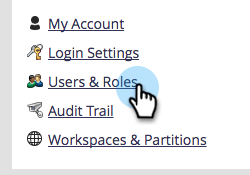
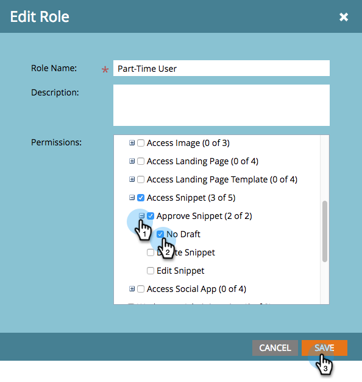

# Activer l’absence de brouillon pour les extraits {#enable-no-draft-for-snippets}

L’option Aucun brouillon pour les fragments de code vous permet de distribuer les modifications des fragments de code sans créer de ressources approuvées les utilisant. Toutes les ressources qui utilisent le fragment de code modifié reçoivent les mises à jour et conservent leurs statuts respectifs :

* Les ressources approuvées obtiennent les mises à jour des fragments de code et restent approuvées.

* Les brouillons obtiennent les mises à jour des fragments de code et restent en mode brouillon

L’option sans brouillon est automatiquement activée pour tous les rôles d’administration. Un administrateur peut ensuite activer cette fonctionnalité pour tout rôle supplémentaire.

>[!NOTE]
>
>**Autorisations d’administration requises**

1. Accédez à la zone **[!UICONTROL Admin]**.

   

1. Cliquez sur **[!UICONTROL Utilisateurs et rôles]**.

   

1. Accédez à l’onglet **[!UICONTROL Rôles]**, sélectionnez un rôle, puis cliquez sur **[!UICONTROL Modifier le rôle]**.

   

1. Développez l’option **[!UICONTROL Accéder à Design Studio]**.

   

1. Développez l’option **[!UICONTROL Extrait de code Access]**.

   

1. Développez l’autorisation **[!UICONTROL Approuver le fragment de code]** et cochez la case **[!UICONTROL Pas de brouillon]**. Cliquez ensuite sur **[!UICONTROL Enregistrer]**.

   

>[!TIP]
>
>Pour désactiver le brouillon, suivez les étapes 1 à 4 ci-dessus, décochez la case Aucun brouillon, puis cliquez sur **[!UICONTROL Enregistrer]**.

>[!MORELIKETHIS]
>
>[Approuver un fragment de code sans brouillon](/help/marketo/product-docs/personalization/segmentation-and-snippets/snippets/approve-a-snippet-with-no-draft.md){target="_blank"}
