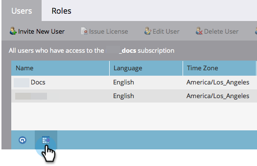

# Exporter une liste d’utilisateurs et d’utilisatrices et de rôles {#export-a-list-of-users-and-roles}

>[!NOTE]
>
>**Autorisations d’administration requises**

Il est assez facile d’exporter une liste complète de vos utilisateurs et rôles utilisateur. Voici comment faire.

1. Accédez à **[!UICONTROL Admin]**.

   

1. Cliquez sur **[!UICONTROL Utilisateurs et rôles]**.

   

1. Ajoutez ou supprimez les colonnes souhaitées avant d’exporter.

   >[!TIP]
   >
   >Pour exporter des rôles, accédez d’abord à l’onglet **[!UICONTROL Rôles]**, puis exportez.

   

1. Cliquez sur l’icône **[!UICONTROL Exporter]**.

   

   Et c&#39;est tout, les amis ! Vous devriez télécharger le nouveau fichier Excel.

   
