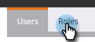

# Exporter les rôles et les autorisations {#export-roles-and-permissions}

Les étapes suivantes expliquent comment exporter tous les rôles et leurs autorisations.

>[!NOTE]
>
>**Autorisations d’administration requises**

1. Accédez à la zone **[!UICONTROL Admin]**.

   

1. Sélectionnez **[!UICONTROL Utilisateurs et rôles]**.

   

1. Cliquez sur l’onglet **[!UICONTROL Rôles]**.

   

1. Faites défiler la page jusqu’au bas, puis cliquez sur le bouton Exporter .

   

>[!NOTE]
>
>Assurez-vous que votre navigateur ne bloque pas les fenêtres pop-up de Marketo.

Les données seront exportées au format CSV et contiendront des rôles, des autorisations et un décompte du nombre d’autorisations activées par groupe.

