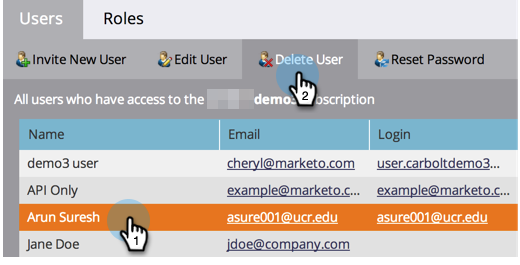

# Gestion des utilisateurs et utilisatrices Marketo {#managing-marketo-users}

>[!IMPORTANT]
>
>Cet article est destiné uniquement à ceux qui n’utilisent _pas_ [Marketo avec Adobe Identity](/help/marketo/product-docs/administration/marketo-with-adobe-identity/adobe-identity-management-overview.md){target="_blank"}. Si vous le faites, suivez les étapes décrites dans [cet article](/help/marketo/product-docs/administration/marketo-with-adobe-identity/add-or-remove-a-user.md){target="_blank"}.

## Créer des utilisateurs {#create-users}

1. Accédez à la zone **[!UICONTROL Admin]**.

   

1. Cliquez sur **[!UICONTROL Utilisateurs et rôles]**.

   

1. Cliquez sur **[!UICONTROL Inviter un nouvel utilisateur]**.

   

1. Saisissez les **[!UICONTROL E-mail]**, **[!UICONTROL Prénom]** et **[!UICONTROL Nom]**.

   

1. Vous pouvez éventuellement saisir un motif pour l’invitation et sélectionner une date d’expiration dans le champ **[!UICONTROL Expiration de l’accès]** à l’aide du sélecteur de date.

   

1. Cliquez sur **[!UICONTROL Suivant]**.

   

   >[!TIP]
   >
   >Une date d’expiration est idéale pour les parties prenantes externes à court terme ou les consultants et consultantes qui n’ont besoin d’un accès à Marketo que pendant une courte période.

   >[!NOTE]
   >
   >Lorsque la date d’expiration est atteinte, l’utilisateur reçoit une notification d’expiration et son compte est verrouillé.

1. Sélectionnez le **[!UICONTROL Rôle]** de votre choix et cliquez sur **[!UICONTROL Suivant]**.

   

1. Apportez des modifications au message d’invitation si nécessaire. Cliquez sur **Send**.

   

   >[!NOTE]
   >
   >L’adresse e-mail/de connexion doit être unique ; si vous l’avez déjà utilisée dans une instance de sandbox, vous devrez en utiliser une autre en production et vice versa.

   

   >[!NOTE]
   >
   >Les invitations expirent trois jours après l’ajout d’un nouvel utilisateur.

Le nouvel utilisateur est maintenant répertorié dans l’onglet Utilisateurs et recevra un e-mail contenant des instructions sur la façon d’activer son compte.

## Supprimer les utilisateurs {#delete-users}

>[!NOTE]
>
>Si l’utilisateur que vous souhaitez supprimer est également un utilisateur Dynamic Chat, vous devez [le supprimer de Dynamic Chat](/help/marketo/product-docs/demand-generation/dynamic-chat/setup-and-configuration/add-or-remove-chat-users.md#remove-a-chat-user){target="_blank"} dans Admin Console avant de pouvoir le supprimer dans Marketo Engage.

1. Accédez à la zone **[!UICONTROL Admin]**.

   

1. Cliquez sur **[!UICONTROL Utilisateurs et rôles]**.

   

1. Sélectionnez l’utilisateur que vous souhaitez supprimer, puis cliquez sur **[!UICONTROL Supprimer l’utilisateur]**.

   

1. Confirmez en cliquant sur **[!UICONTROL OK]**.

   

## Réinitialiser les mots de passe utilisateur {#reset-user-passwords}

1. Accédez à la zone **[!UICONTROL Admin]**.

   

1. Cliquez sur **[!UICONTROL Utilisateurs et rôles]**.

   

1. Sélectionnez un utilisateur et cliquez sur **[!UICONTROL Réinitialiser le mot de passe]**.

   

1. Cliquez sur **[!UICONTROL Fermer]** pour ignorer l’invite.

   

L’utilisateur recevra un courrier électronique contenant des instructions de réinitialisation de mot de passe.

>[!TIP]
>
>Si l’utilisateur ne voit pas l’e-mail dans sa boîte de réception, demandez-lui de vérifier son dossier Courrier indésirable/spam.

## Modifier les autorisations et modifier les informations utilisateur {#change-permissions-and-edit-user-information}

1. Accédez à la zone **[!UICONTROL Admin]**.

   

1. Cliquez sur **[!UICONTROL Utilisateurs et rôles]**.

   

1. Sélectionnez un utilisateur et cliquez sur **[!UICONTROL Modifier l’utilisateur]**.

   

1. Vous pouvez modifier les informations utilisateur et le rôle associé. Cliquez sur **[!UICONTROL Enregistrer]**

   

>[!CAUTION]
>
>Si vous êtes le seul administrateur dans Marketo, veillez à ne pas supprimer vos propres droits d’administrateur.

>[!NOTE]
>
>Si un nouvel utilisateur est invité en tant qu’administrateur ou si un administrateur est supprimé, tous les administrateurs actuels recevront une notification par e-mail.

Un travail génial ! Vous savez maintenant comment créer un utilisateur, supprimer un utilisateur, réinitialiser le mot de passe d’un utilisateur et modifier des utilisateurs.
