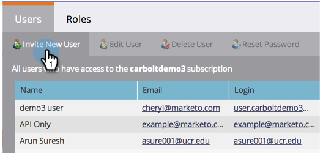
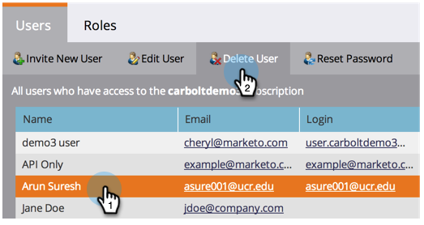
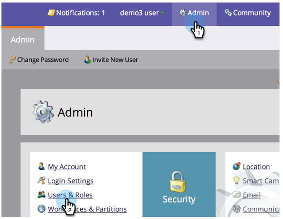

# Gestion des utilisateurs du marketing {#managing-marketo-users}

## Créer des utilisateurs {#create-users}

1. Accédez à **Admin** et cliquez sur **Utilisateurs et rôles**.

   

1. Cliquez sur **Inviter un nouvel utilisateur**.

   

1. Entrez **Adresse électronique**, **Prénom** et **Nom. **

   ** 

   **

1. Si vous le souhaitez, entrez un motif pour l&#39;invitation et sélectionnez une date d&#39;expiration dans le champ **Access Expires** à l&#39;aide du sélecteur de dates.

   

1. Cliquez sur **Suivant**.

   

   >[!TIP]
   >
   >Une date d’expiration est idéale pour les parties prenantes externes à court terme ou les consultants qui ont besoin de Marketing pour n’y accéder que pour une courte période.

   >[!NOTE]
   >
   >Lorsque la date d’expiration arrive, l’utilisateur reçoit une notification d’expiration et son compte est verrouillé.

1. Sélectionnez le **rôle **de votre choix et cliquez sur **Suivant**.

   

1. Apportez les modifications nécessaires au message d’invitation. Cliquez sur **Envoyer**.

   

   >[!NOTE]
   >
   >Le courriel/la connexion doit être unique ; si vous l’avez déjà utilisé dans une instance sandbox, vous devez en utiliser une autre en production et vice versa.

   

   >[!NOTE]
   >
   >Les invitations expirent trois jours après l’ajout d’un nouvel utilisateur.

Le nouvel utilisateur est désormais répertorié dans l’onglet Utilisateurs et recevra un courrier électronique contenant des instructions sur la façon d’activer son compte.

## Supprimer des utilisateurs {#delete-users}

1. Accédez à Admin et cliquez sur Utilisateurs et rôles.

   

1. Sélectionnez l’utilisateur à supprimer, puis cliquez sur Supprimer l’utilisateur.

   

1. Confirmez en cliquant sur OK.

   

## Réinitialiser les mots de passe utilisateur {#reset-user-passwords}

1. Accédez à Admin et cliquez sur Utilisateurs et rôles.

   

1. Sélectionnez un utilisateur et cliquez sur Réinitialiser le mot de passe.

   

1. Cliquez sur Fermer pour fermer l’invite.

   

L&#39;utilisateur recevra un courrier électronique contenant des instructions de réinitialisation du mot de passe.

>[!TIP]
>
>Si l&#39;utilisateur ne voit pas le courrier électronique dans sa boîte de réception, demandez-lui de vérifier son dossier de courrier indésirable.

## Modifier les autorisations et modifier les informations utilisateur {#change-permissions-and-edit-user-information}

1. Accédez à **Admin** et cliquez sur **Utilisateurs et rôles.**

   

1. Sélectionnez un utilisateur et cliquez sur **Modifier l’utilisateur**.

   

1. Vous pouvez modifier les informations utilisateur et modifier le rôle associé. Cliquez sur **Enregistrer**.

   

>[!CAUTION]
>
>Si vous êtes le seul administrateur de Marketo, veillez à ne pas supprimer vos propres droits d’administrateur.

>[!NOTE]
>
>Si un nouvel utilisateur est invité en tant qu’administrateur ou si un administrateur est supprimé, tous les administrateurs en cours reçoivent une notification par courrier électronique.

Un travail formidable ! Vous savez maintenant comment créer un utilisateur, supprimer un utilisateur, réinitialiser son mot de passe et modifier les utilisateurs.
