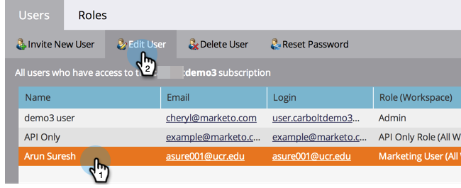
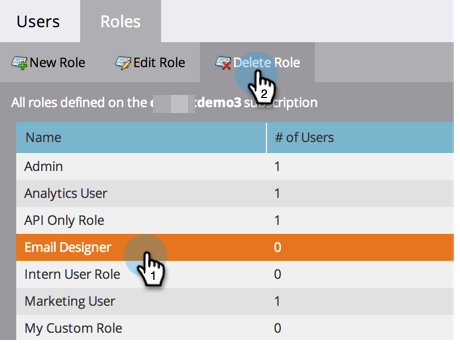

# Gestion des rôles et autorisations des utilisateurs et des utilisatrices {#managing-user-roles-and-permissions}

Définissez, créez et modifiez des rôles d’utilisateur et affectez-les à des utilisateurs. Vous pouvez ainsi contrôler les zones et les fonctionnalités auxquelles chaque utilisateur de Marketo a accès.

Par exemple, un utilisateur ou une utilisatrice marketing a généralement besoin d’un accès étendu à l’ensemble de l’application pour créer, modifier et déployer des e-mails, des pages de destination et des programmes. Un concepteur web, en revanche, passe presque tout son temps dans Design Studio à créer des ressources à utiliser dans les e-mails et les landing pages. De plus, bien que les dirigeants d’entreprise fassent un usage intensif des rapports de Marketo dans le domaine Analytics, ils n’ont pas nécessairement besoin de créer ou d’orienter eux-mêmes les ressources ou les programmes.

>[!NOTE]
>
>**Autorisations d’administrateur requises**

Marketo fournit plusieurs rôles intégrés, avec différents niveaux d’accès :

* **Admin** - toutes les parties de l&#39;application, y compris la section Admin
* **Utilisateur standard** - Toutes les parties de l’application, à l’exception de la section Admin
* **Utilisateur marketing** - Toutes les parties de l’application, à l’exception de la section Admin
* **Web Designer** - Uniquement Design Studio
* **Utilisateur Analytics** - uniquement la section Analytics

Vous ne pouvez pas modifier les rôles Administrateur et Utilisateur standard, mais vous pouvez modifier les autres. Vous pouvez également créer des rôles personnalisés pour répondre aux structures organisationnelles spécifiques de votre entreprise.

## Marketo avec Adobe Identity {#marketo-with-adobe-identity}

Si vous utilisez Marketo avec Adobe Identity, la liste des descriptions de profil [se trouve ici](/help/marketo/product-docs/administration/marketo-with-adobe-identity/adobe-identity-management-overview.md#profile-levels).

## Affecter des rôles à un utilisateur {#assign-roles-to-a-user}

Vous pouvez affecter des rôles à un utilisateur ou une utilisatrice lorsque vous [créez des utilisateurs et utilisatrices pour la première fois](/help/marketo/product-docs/administration/users-and-roles/create-delete-edit-and-change-a-user-role.md) ou en [&#x200B; un utilisateur ou une utilisatrice existant(e)](/help/marketo/product-docs/administration/users-and-roles/managing-marketo-users.md).

1. Accédez à la zone **[!UICONTROL Admin]**.

   

1. Cliquez sur **[!UICONTROL Utilisateurs et rôles]**.

   

1. Dans la liste, sélectionnez l’utilisateur que vous souhaitez modifier, puis cliquez sur **[!UICONTROL Modifier l’utilisateur]**.

   

1. Sous **[!UICONTROL Rôles]**, sélectionnez les rôles que vous souhaitez affecter à l’utilisateur, en fonction des autorisations dont il a besoin, puis cliquez sur **[!UICONTROL Enregistrer]**.

   

   >[!NOTE]
   >
   >Pour en savoir plus sur chaque rôle, voir [Descriptions des autorisations de rôle](/help/marketo/product-docs/administration/users-and-roles/descriptions-of-role-permissions.md).

## Créer un nouveau rôle {#create-a-new-role}

Parfois, votre organisation compte des employés dont les rôles sont très spécifiques et qui nécessitent une combinaison personnalisée d’autorisations.

1. Accédez à la zone **[!UICONTROL Admin]**.

   

1. Cliquez sur **[!UICONTROL Utilisateurs et rôles]**.

   

1. Cliquez sur l’onglet **[!UICONTROL Rôles]**.

   

1. Cliquez sur **[!UICONTROL Nouveau rôle]**.

   

1. Saisissez un **[!UICONTROL Nom du rôle]** et un **[!UICONTROL Description]** (facultatif), puis sélectionnez les autorisations dont les utilisateurs et utilisatrices bénéficiant de ce rôle auront besoin.

   

## Modifier un rôle {#edit-a-role}

Si vous devez modifier les autorisations associées à un rôle existant, vous pouvez modifier le rôle.

1. Accédez à la zone **[!UICONTROL Admin]**.

   

1. Cliquez sur **[!UICONTROL Utilisateurs et rôles]**.

   

1. Cliquez sur l’onglet **[!UICONTROL Rôles]**.

   

1. Dans la liste, sélectionnez le rôle à modifier, puis cliquez sur **[!UICONTROL Modifier le rôle]**.

   

1. Modifiez les **[!UICONTROL Nom du rôle]** et **[!UICONTROL Description]** si nécessaire, modifiez la sélection des **[!UICONTROL Autorisations]** associées, puis cliquez sur **[!UICONTROL Enregistrer]** lorsque vous avez terminé.

   

   >[!NOTE]
   >
   >Les utilisateurs et utilisatrices disposant du rôle que vous avez modifié recevront les autorisations modifiées après s’être déconnectés puis reconnectés.

## Supprimer un rôle {#delete-a-role}

Si un rôle devient inutile, vous pouvez le supprimer.

1. Accédez à la zone **[!UICONTROL Admin]**.

   

1. Cliquez sur **[!UICONTROL Utilisateurs et rôles]**.

   

1. Cliquez sur l’onglet **[!UICONTROL Rôles]**.

   

1. Dans la liste, sélectionnez le rôle à supprimer, puis cliquez sur **[!UICONTROL Supprimer le rôle]**.

   

1. Cliquez sur **[!UICONTROL Supprimer]** pour confirmer.

   
