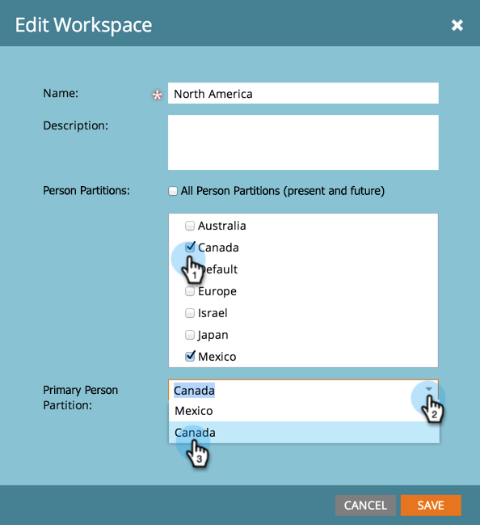

# Affecter des partitions de personne aux espaces de travail {#assign-person-partitions-to-workspaces}

Suivez les étapes ci-dessous pour modifier les affectations de partition de personne et d’espace de travail :

>[!NOTE]
>
>**Autorisations d’administration requises**

>[!PREREQUISITES]
>
>[Création d’un Workspace](/help/marketo/product-docs/administration/workspaces-and-person-partitions/create-a-new-workspace.md){target="_blank"}

>[!CAUTION]
>
>Les espaces de travail et les partitions de personne peuvent être complexes. Contactez l’assistance technique de [&#128279;](https://nation.marketo.com/t5/Support/ct-p/Support){target="_blank"} pour obtenir de l’aide sur leur configuration.

1. Accédez à la zone **[!UICONTROL Admin]**.

   

1. Cliquez sur **[!UICONTROL Workspaces et partitions]**.

   

1. Sélectionnez votre espace de travail et cliquez sur **[!UICONTROL Modifier Workspace]**.

   

1. Modifiez les informations de répartition de la personne à modifier.

   

   >[!NOTE]
   >
   >* La case à cocher « [!UICONTROL Toutes les partitions de personne] » indique que cet espace de travail a accès à toutes les partitions de personne du système.
   >
   >* Les partitions de personne par Principal sont la valeur par défaut où toutes les personnes seront saisies. Utilisez [étapes de flux](/help/marketo/product-docs/core-marketo-concepts/smart-campaigns/flow-actions/use-add-choice-in-a-flow-step.md) ou [règles d’affectation](/help/marketo/product-docs/administration/workspaces-and-person-partitions/assigning-person-partitions-with-assignment-rules.md){target="_blank"} pour déplacer des personnes entre les partitions.

1. Cliquez sur **[!UICONTROL Enregistrer]**

   

Après l’enregistrement, vous devriez voir les modifications.

>[!MORELIKETHIS]
>
>[Présentation des espaces de travail et des partitions de personne](/help/marketo/product-docs/administration/workspaces-and-person-partitions/understanding-workspaces-and-person-partitions.md){target="_blank"}.
