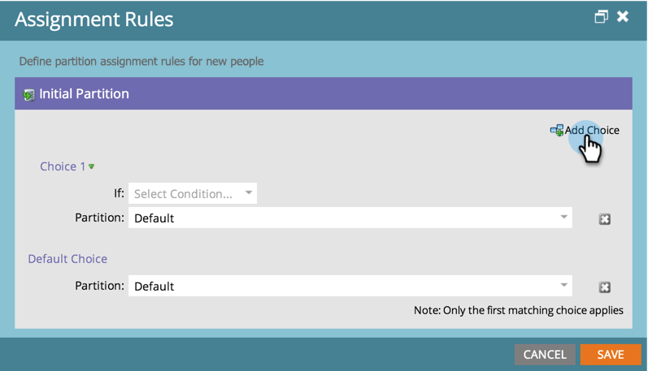

# Affectation de partitions de personne avec des règles d’affectation {#assigning-person-partitions-with-assignment-rules}

>[!NOTE]
>
>**Autorisations d’administrateur requises**

>[!PREREQUISITES]
>
>[Créer une partition de personne](/help/marketo/product-docs/administration/workspaces-and-person-partitions/create-a-person-partition.md)

Lors de l’utilisation de partitions de personne, configurez des règles d’affectation pour acheminer les personnes créées à partir de votre CRM vers leurs partitions respectives.

>[!NOTE]
>
>Seules les personnes créées dans Marketo à partir de votre CRM et via l’API SOAP se verront appliquer des règles d’affectation.

1. Accédez à la zone **[!UICONTROL Admin]**.

   

1. Cliquez sur **[!UICONTROL Workspaces et partitions]**.

   

1. Sous l’onglet **[!UICONTROL Partitions de personne]**, cliquez sur **[!UICONTROL Règles d’affectation]**.

   

1. Cliquez sur **[!UICONTROL Ajouter un choix]** pour ajouter des conditions de routage des personnes dans des partitions de personne.

   

1. Sélectionnez le champ sur lequel la condition doit être créée.

   

1. Choisissez l’opérateur de choix et saisissez une valeur.

   

1. Sélectionnez la partition des personnes dans laquelle vous souhaitez que les personnes qui remplissent les conditions entrent.

   

   >[!NOTE]
   >
   >Vous pouvez ajouter autant de choix que vous le souhaitez.

1. Cliquez sur **[!UICONTROL Enregistrer]**

   

Et voilà ! Vous avez affecté des règles pour remplir vos partitions de personne avec des personnes !

>[!NOTE]
>
>Le choix par défaut sera appliqué si aucune des conditions précédentes n’est remplie.
