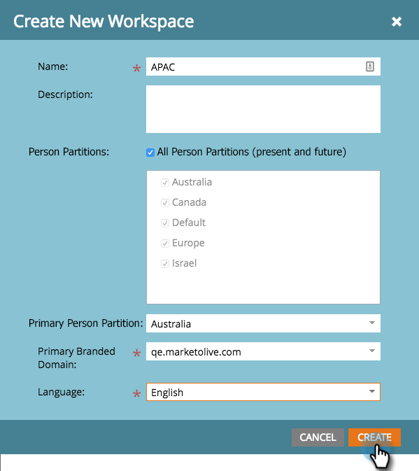

# Création d’un Workspace {#create-a-new-workspace}

Les espaces de travail sont utiles pour subdiviser votre entreprise. Voici quelques raisons de configurer des espaces de travail :

* Géographie : Opérations marketing en Europe et Opérations marketing en Amérique du Nord
* Unité opérationnelle A et unité opérationnelle B

Voici comment créer un espace de travail.

>[!NOTE]
>
>**Autorisations d’administrateur requises**

>[!NOTE]
>
>Commencez par [Présentation des espaces de travail et des partitions de personne](/help/marketo/product-docs/administration/workspaces-and-person-partitions/understanding-workspaces-and-person-partitions.md){target="_blank"}.

>[!TIP]
>
>Pour en savoir plus sur les bonnes pratiques de Workspace, contactez les [Services professionnels Marketo](https://business.adobe.com/products/marketo/services-support.html){target="_blank"}.

1. Accédez à la zone **[!UICONTROL Admin]**.

   

1. Cliquez sur **[!UICONTROL Espaces de travail et partitions]**.

   

1. Cliquez sur **[!UICONTROL New Workspace]**.

   

1. Saisissez un **[!UICONTROL Nom]**, puis sélectionnez le **[!UICONTROL Person Partitions]** que vous souhaitez utiliser. Sélectionnez une **[!UICONTROL partition de personne de Principal]**. Veillez à [créer des partitions de personne](/help/marketo/product-docs/administration/workspaces-and-person-partitions/create-a-person-partition.md){target="_blank"} si ce n&#39;est déjà fait.

   

   >[!NOTE]
   >
   >* La case à cocher **[!UICONTROL Toutes les partitions de personne]** signifie que cet espace de travail peut utiliser toutes les partitions de personne dans le système.
   >
   >* La **[!UICONTROL partition de personne de Principal]** agit comme valeur par défaut et c’est là que toutes les personnes seront affectées.

   >[!IMPORTANT]
   >
   >Si vous avez activé plusieurs domaines de marque, vous devez choisir un domaine de marque principale.

1. Sélectionnez la langue de l&#39;espace de travail.

   

   >[!NOTE]
   >
   >Lors de sa création, Marketo envoie des exemples de ressources dans l’espace de travail. La langue permet à ces objets d’amorce d’être dans une langue autre que l’anglais.

1. Cliquez sur **[!UICONTROL Créer]**.

   

Créez autant d’espaces de travail que nécessaire et affectez-leur la ou les partition(s) de personne appropriée(s).

Après avoir créé votre espace de travail, vous devriez voir la mise à jour.

