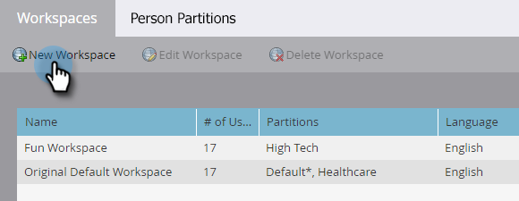
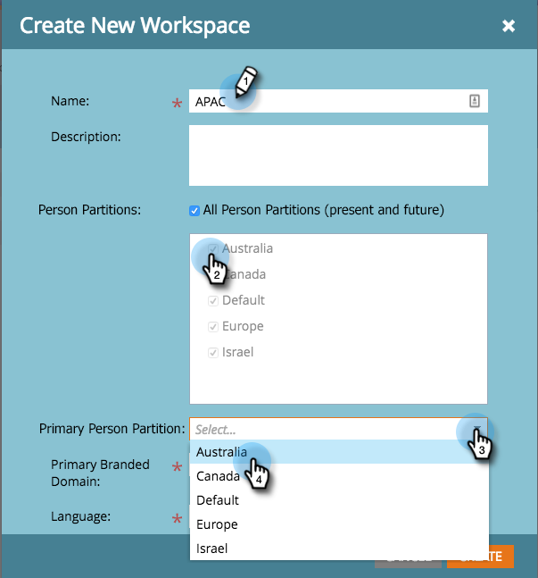
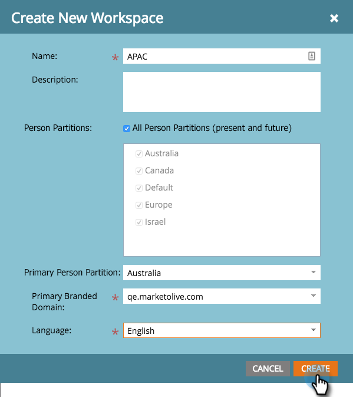
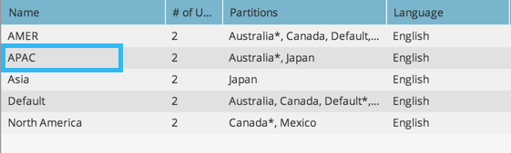

# Créer un espace de travail {#create-a-new-workspace}

Les espaces de travail sont utiles pour subdiviser votre entreprise. Les raisons de configurer des espaces de travail sont les suivantes :

* Géographie : Opérations de marketing en Europe et en Amérique du Nord
* Unité opérationnelle A par rapport à l’unité opérationnelle B

>[!NOTE]
>
>**Autorisations d’administration requises**

>[!NOTE]
>
>Pour plus d’informations, voir [Présentation des espaces de travail et des partitions de personne](/help/marketo/product-docs/administration/workspaces-and-person-partitions/understanding-workspaces-and-person-partitions.md){target="_blank"}.

>[!TIP]
>
>Pour en savoir plus sur les bonnes pratiques relatives à Workspace, contactez [les services professionnels de Marketo](https://business.adobe.com/fr/products/marketo/services-support.html){target="_blank"}.

1. Accédez à la zone **[!UICONTROL Admin]**.

   

1. Cliquez sur **[!UICONTROL Workspaces et partitions]**.

   

1. Cliquez sur **[!UICONTROL Nouveau Workspace]**.

   

1. Saisissez un **[!UICONTROL Nom]**, puis sélectionnez les **[!UICONTROL Partitions de personne]** à utiliser. Choisissez une partition de personne de **[!UICONTROL Principal]**. Assurez-vous que les partitions [personne](/help/marketo/product-docs/administration/workspaces-and-person-partitions/create-a-person-partition.md){target="_blank"} ont été créées si elles ne l’ont pas déjà été.

   

   >[!NOTE]
   >
   >* La case à cocher **[!UICONTROL Toutes les partitions de personne]** signifie que cet espace de travail peut utiliser toutes les partitions de personne du système.
   >
   >* La **[!UICONTROL partition de personne par Principal]** agit comme la valeur par défaut et c’est là que toutes les personnes seront affectées.

   >[!IMPORTANT]
   >
   >Si vous avez activé plusieurs domaines de marque, vous devez choisir un domaine de marque principal.

1. Sélectionnez la langue de l’espace de travail.

   

   >[!NOTE]
   >
   >Lors de sa création, Marketo amorcera des exemples de ressources dans l’espace de travail. La langue permet à ces objets prédéfinis d’être dans une langue autre que l’anglais.

1. Cliquez sur **[!UICONTROL Créer]**.

   

Créez autant d’espaces de travail que nécessaire et attribuez-leur la ou les partitions de personne appropriées.

Après avoir créé votre espace de travail, vous devriez voir la mise à jour.

