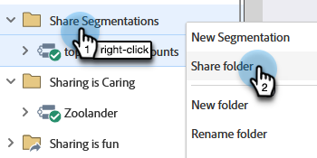

# Partager des segmentations dans les espaces de travail et les partitions {#share-segmentations-across-workspaces-and-partitions}

>[!PREREQUISITES]
>
>Cet article est destiné uniquement aux clients qui disposent d’espaces de travail et de partitions.

## Qu’est-ce qu’une segmentation ? {#whats-a-segmentation}

Marketo est très efficace pour sélectionner les bonnes personnes pour un programme ou une campagne intelligente. Toutefois, pour les personnages plus permanents, vous devez utiliser des segmentations. Ils sont nécessaires pour utiliser du contenu dynamique avancé dans Marketo.

>[!NOTE]
>
>Découvrez [ comment créer des segmentations ](/help/marketo/product-docs/personalization/segmentation-and-snippets/segmentation/create-a-segmentation.md).

Une fois ces personnes configurées (_et_ vous utilisez des espaces de travail), vous souhaiterez les partager dans vos espaces de travail. Voici quelques bonnes choses à savoir :

## Règles et conseils {#rules-tips}

* Chaque abonnement Marketo peut contenir jusqu’à 20 segmentations « au total » sur plusieurs espaces de travail (**pas 20 par espace de travail**).
* Vous pouvez uniquement partager une Segmentation avec les espaces de travail auxquels vous avez accès.
* Veillez à créer et à utiliser un espace de travail **par défaut qui soit visible dans toutes les partitions**.

* Le traitement de la segmentation s’exécute uniquement sur les personnes de l’espace de travail où la segmentation est créée.

   * Créez la segmentation que vous souhaitez partager dans le Workspace par défaut.
      * Approuver la segmentation
      * Un dossier verrouillé apparaît dans l’espace de travail partagé et la segmentation est en lecture seule.
      * La version partagée ne peut pas être modifiée. Vous pouvez uniquement modifier la segmentation d’origine à l’emplacement où elle a été créée.

   * Lorsque vous cliquez sur un segment (par exemple, Healthcare) dans une segmentation partagée, les personnes que vous voyez ne sont que des personnes dans la partition associée à l’espace de travail que vous consultez.
      * Si vous créez une Segmentation dans Workspace 1 (WS1) et que vous la partagez avec WS2, et que WS1 n’a pas accès à la partition pour WS2, la Segmentation NE SERA PAS recalculée.
      * Si vous créez une Segmentation dans un espace de travail qui comporte des partitions limitées, puis que vous la partagez avec un autre espace de travail, cet espace de travail qui a reçu la Segmentation partagée ne verra les personnes que si elles se chevauchent.

>[!NOTE]
>
>Certaines de ces règles sont un peu complexes. Le moyen le plus simple de commencer est de tester avec des personnes spécifiques. Vous pouvez toujours effectuer de nouvelles segmentations et vous débarrasser des anciennes.

## Exemples de scénarios {#example-scenarios}

## Partager une segmentation {#share-a-segmentation}

1. Accédez à la **[!UICONTROL Base de données]**.

   

1. Faites un clic droit sur **[!UICONTROL Segmentations]** et sélectionnez **[!UICONTROL Nouveau dossier]**.

   

1. Nommez le dossier que vous allez partager sur plusieurs espaces de travail (par exemple : Partager des segments) et cliquez sur **[!UICONTROL Créer]**.

   

1. Déplacez la ou les segmentations à partager dans le dossier .

   

1. Cliquez avec le bouton droit sur le dossier et sélectionnez **[!UICONTROL Partager le dossier]**.

   

1. Sélectionnez le ou les espaces de travail avec lesquels vous souhaitez partager le dossier. Cliquez sur **[!UICONTROL Enregistrer]**

   

   >[!NOTE]
   >
   >La boîte de dialogue affiche les espaces de travail que vous êtes autorisé à afficher. C’est pourquoi Marketo recommande de créer et de partager des Segmentations à partir de l’espace de travail par défaut qui bénéficie d’une visibilité sur tous les espaces de travail et partitions.

Le dossier d’origine s’affiche dans l’arborescence de la base de données avec une flèche indiquant qu’il est partagé avec d’autres espaces de travail. Dans l’espace de travail partagé, le dossier s’affiche avec un verrou pour indiquer que le contenu du dossier a été partagé à partir d’un autre espace de travail et qu’il est en lecture seule.
