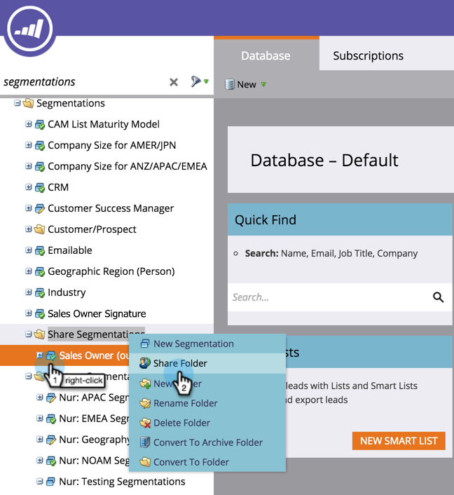

# Partager des segments entre les espaces de travail et les partitions {#share-segmentations-across-workspaces-and-partitions}

>[!PREREQUISITES]
>
>Cet article s&#39;adresse uniquement aux clients disposant d&#39;espaces de travail et de partitions

## Qu&#39;est-ce qu&#39;une segmentation ? {#whats-a-segmentation}

Marketo est un excellent outil pour choisir les bonnes personnes pour un programme ou une campagne intelligente. Cependant, pour des personnages plus permanents, vous devez utiliser des segmentations. Ils sont nécessaires pour utiliser un contenu dynamique avancé dans Marketo.

>[!NOTE]
>
>**Plongée profonde**
>
>Découvrez [comment créer des segments](../../../product-docs/personalization/segmentation-and-snippets/segmentation/create-a-segmentation.md).

Une fois ces personnages configurés (**et** vous utilisez des espaces de travail), vous souhaiterez les partager dans vos espaces de travail. Voici quelques bonnes choses à savoir :

## Règles et conseils {#rules-tips}

* Chaque abonnement de marketing peut contenir jusqu’à 20 segments &quot;total&quot; sur plusieurs espaces de travail (**pas 20 par espace de travail**).
* Vous pouvez uniquement partager une segmentation avec les espaces de travail auxquels vous avez accès.
* Veillez à créer et à utiliser un espace de travail **par défaut qui dispose d&#39;une visibilité sur toutes les partitions**.

* Le traitement de la segmentation s’exécute uniquement sur les personnes de l’espace de travail dans lequel la segmentation est créée.

   * Créez la segmentation que vous souhaitez partager dans l’espace de travail par défaut.

      * Approuver la segmentation
      * L’espace de travail partagé voit un dossier verrouillé et la segmentation est en lecture seule.
      * La version partagée ne peut pas être modifiée. Vous pouvez uniquement modifier la segmentation d’origine dans laquelle elle a été créée.
   * Lorsque vous cliquez sur un segment (par exemple, Santé) dans une segmentation partagée, les personnes que vous voyez ne seront que des personnes dans la partition associée à l&#39;espace de travail que vous visualisez.

      * Si vous créez une segmentation dans Workspace 1 (WS1) et que vous la partagez avec WS2 et WS1 n’a pas accès à la partition pour WS2, la segmentation NE SERA PAS recalculée.
      * Si vous créez une segmentation dans un espace de travail contenant des partitions limitées, puis que vous la partagez avec un autre espace de travail, cet espace de travail qui a reçu la segmentation partagée ne voit les personnes que si elles se chevauchent.

>[!NOTE]
>
>Certaines de ces règles sont un peu complexes. La façon la plus simple de commencer est de tester avec des personnes spécifiques. Vous pouvez toujours créer de nouvelles segmentations et vous débarrasser des anciennes.

## Exemples de scénarios {#example-scenarios}

** 

**

## Partager une segmentation {#share-a-segmentation}

1. Accédez à la base de données.

   

1. Cliquez avec le bouton droit de la souris sur Segmentations et sélectionnez Nouveaux dossiers.

   

1. Nommez le dossier que vous allez partager dans les espaces de travail (par exemple : Partager des segments.)

   

1. Déplacez les segments que vous souhaitez partager dans le dossier.

   

1. Cliquez avec le bouton droit sur le dossier et sélectionnez Partager le dossier.

   

1. Sélectionnez le ou les espaces de travail avec lesquels vous souhaitez partager le dossier. Cliquez sur Enregistrer.

   

   >[!NOTE]
   >
   >La boîte de dialogue affiche les espaces de travail pour lesquels vous disposez de droits d’accès à la vue. C’est pourquoi Marketing recommande de créer et de partager des segments à partir de l’espace de travail par défaut, avec une visibilité sur tous les espaces de travail et partitions.

Le dossier d&#39;origine s&#39;affiche dans l&#39;arborescence de la base de données avec une flèche indiquant qu&#39;il est partagé avec d&#39;autres espaces de travail. Depuis l’espace de travail partagé, le dossier s’affiche avec un verrou pour indiquer que le contenu du dossier a été partagé à partir d’un autre espace de travail et qu’il est en lecture seule.

>[!NOTE]
>
>**Articles connexes**
>
>[Segmentation et extraits de code](http://docs.marketo.com/display/docs/segmentation+and+snippets)

