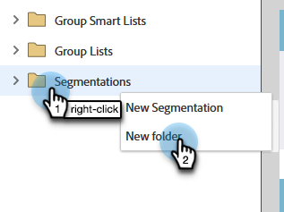
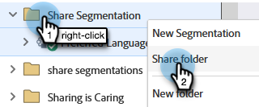

# Présentation des espaces de travail et des partitions de personnes {#understanding-workspaces-and-person-partitions}

## Espaces de travail {#workspaces}

>[!CAUTION]
>
>La configuration des espaces de travail peut être complexe. Contactez le support technique de [Marketo](https://nation.marketo.com/t5/Support/ct-p/Support) pour savoir s&#39;ils vous conviennent.

Les espaces de travail sont des zones distinctes de Marketo qui contiennent des ressources marketing telles que des programmes, des pages de destination, des e-mails, etc. Ils peuvent être utilisés par plusieurs personnes. Chaque utilisateur a accès à un ou plusieurs espaces de travail.

>[!NOTE]
>
>**Exemple**
>
>Voici quelques raisons d’utiliser un espace de travail :
>
>* Géographie : Les services marketing d’Europe, d’Asie et d’Amérique du Nord disposent chacun d’un espace de travail
>* Unité opérationnelle : [!DNL Quicken], [!DNL Quickbooks] et [!DNL TurboTax] ont chacun un espace de travail
>
>Dans chaque cas, la séparation est due au fait que les ressources marketing sont complètement différentes. S’ils partagent des ressources marketing, les espaces de travail peuvent ne pas vous convenir.

>[!NOTE]
>
>Découvrez comment créer [créer un espace de travail](/help/marketo/product-docs/administration/workspaces-and-person-partitions/create-a-new-workspace.md).

## Partage sur plusieurs espaces de travail {#sharing-across-workspaces}

Découvrez comment partager des ressources sur plusieurs espaces de travail. Il fonctionne de la même manière pour tout ce que vous souhaitez partager ; cet exemple illustre les segmentations.

>[!NOTE]
>
>Le dossier parent contenant vos ressources est le seul dossier qui peut être partagé, et non les dossiers enfants.

1. Cliquez sur **[!UICONTROL Base de données]**.

   

1. Cliquez avec le bouton droit sur le dossier Segmentation et cliquez sur **[!UICONTROL Nouveau dossier]**.

   

1. Nommez votre dossier et cliquez sur **[!UICONTROL Créer]**.

   

1. Déplacez la ou les ressources à partager dans le dossier .

   

1. Cliquez avec le bouton droit sur le dossier et sélectionnez **[!UICONTROL Partager le dossier]**.

   

1. Sélectionnez le ou les espaces de travail avec lesquels vous souhaitez partager le dossier et cliquez sur **[!UICONTROL Enregistrer]**. La boîte de dialogue Partager le dossier affiche uniquement les espaces de travail que vous êtes autorisé à afficher.

   

   >[!NOTE]
   >
   >Le dossier d’origine comporte désormais une petite flèche verte, indiquant qu’il a été partagé. Dans l’espace de travail partagé, le dossier comporte un cadenas, indiquant la lecture seule.

Vous pouvez partager ces éléments sur plusieurs espaces de travail.

* Modèles d’e-mail
* Modèles de page de destination
* Modèles
* Campagnes intelligentes
* [Listes dynamiques](/help/marketo/product-docs/core-marketo-concepts/smart-lists-and-static-lists/using-smart-lists/reference-a-list-or-smart-list-across-workspaces.md)
* [Segmentations](/help/marketo/product-docs/administration/workspaces-and-person-partitions/share-segmentations-across-workspaces-and-partitions.md)
* Extraits

## Clonage sur plusieurs espaces de travail {#cloning-across-workspaces}

Pour les ressources qui ne sont pas des modèles, il est préférable de les cloner en tant que ressources locales dans un programme. Avec le niveau d’accès approprié, vous pouvez faire glisser ces ressources et les déposer dans un autre espace de travail :

* Programmes
* E-mails
* Pages de destination
* Formulaires

>[!IMPORTANT]
>
>Bien que tous les éléments répertoriés ci-dessus puissent être clonés dans les espaces de travail, les e-mails, les formulaires et les pages de destination _doivent se trouver dans un programme_ au moment du clonage.

>[!NOTE]
>
>Lors du clonage de ressources comportant des modèles, ces modèles doivent être partagés avec l’espace de travail de destination.

## Déplacement d’Assets vers d’autres espaces de travail {#moving-assets-to-other-workspaces}

Pour déplacer des ressources vers un nouvel espace de travail, placez-les dans un dossier et faites-le glisser vers l’autre espace de travail.

>[!NOTE]
>
>Vous ne pouvez pas déplacer un programme qui contient des membres d&#39;un espace de travail à un autre.

## Répartitions de l&#39;individu {#person-partitions}

Les partitions de personne se comportent comme des bases de données distinctes. Chaque partition a ses propres utilisateurs qui ne dédupliquent pas ou ne se mélangent pas avec d&#39;autres partitions. Si vous pensez avoir un cas d’utilisation professionnel qui peut nécessiter d’avoir des enregistrements en double avec la même adresse e-mail, contactez l’assistance de [Marketo](https://nation.marketo.com/t5/Support/ct-p/Support).

Vous pouvez affecter des partitions de personne aux [espaces de travail](create-a-new-workspace.md) dans les configurations suivantes :

* partition un espace de travail à une personne (1:1)
* partition d’un espace de travail pour plusieurs personnes (1:x)
* plusieurs espaces de travail pour une partition personne (x:1)

>[!NOTE]
>
>Raisons d’utiliser une partition de personne :
>
>* Vos espaces de travail disposent non seulement de ressources différentes, mais ne partagent pas non plus de personnes
>* Vous voulez des doublons pour d&#39;autres raisons commerciales

>[!CAUTION]
>
>Les partitions des personnes n’interagissent pas les unes avec les autres. Soyez donc prudent lors de leur configuration.

>[!NOTE]
>
>Découvrez comment [créer une partition de personne](/help/marketo/product-docs/administration/workspaces-and-person-partitions/create-a-person-partition.md).
