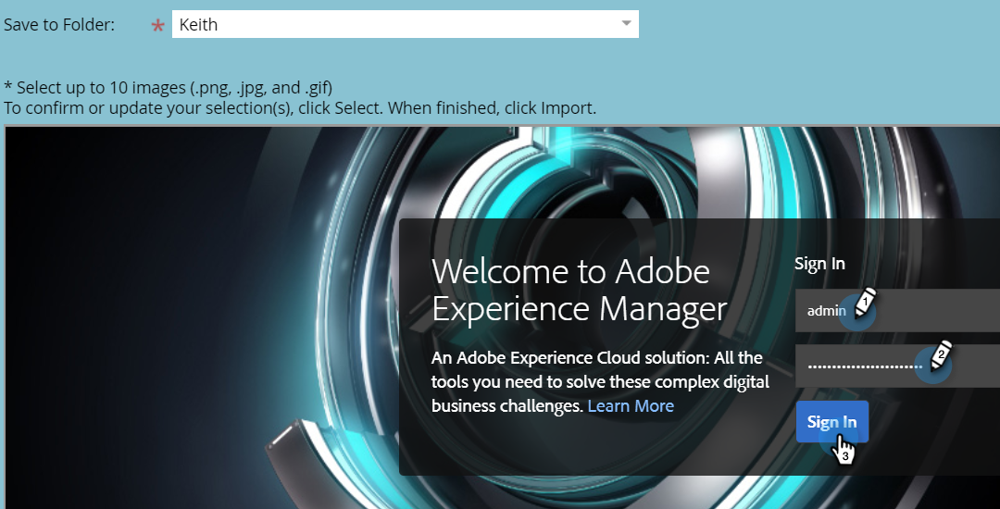

# Importer des ressources avec Adobe Experience Manager {#importing-assets-with-adobe-experience-manager}

Le sélecteur de ressources permet aux clients Marketo d’accéder aux ressources AEM, de les sélectionner et de les importer dans le [!DNL Design Studio] Marketo. **Des autorisations d’administrateur sont requises**.

>[!AVAILABILITY]
>
>Tout le monde n’a pas acheté cette fonctionnalité. Pour plus d’informations, contactez l’équipe du compte Adobe (votre gestionnaire de compte).

>[!PREREQUISITES]
>
>Vérifiez que la configuration  a déjà été effectuée.

>[!IMPORTANT]
>
>Actuellement, cette fonctionnalité n’est entièrement prise en charge que dans [!DNL Firefox]. Il n’est pas pris en charge dans [!DNL Safari] et peut ne pas fonctionner dans la dernière version de [!DNL Chrome], selon les paramètres de vos cookies [!DNL SameSite].

1. Cliquez sur **[!UICONTROL Design Studio]**.

   

1. Cliquez sur le menu déroulant Nouveau et sélectionnez **[!UICONTROL Importer depuis Adobe Experience Manager]**.

   

1. Sélectionnez le dossier dans lequel vos images seront enregistrées.

   

1. Connectez-vous à Adobe Experience Manager (si ce n’est pas déjà fait).

   

1. Choisissez votre dossier. Sélectionnez ensuite les images souhaitées en cliquant sur la miniature (vous pouvez en choisir jusqu’à 10). Cliquez sur **[!UICONTROL Sélectionner]** lorsque vous avez terminé.

   

   >[!NOTE]
   >
   >La taille des images ne peut pas dépasser 100MB.

1. Cliquez sur **[!UICONTROL Importer]** pour terminer le processus.

   

   Cliquez sur **[!UICONTROL Fermer]** pour revenir à Design Studio.

   

## Éléments à noter {#things-to-note}

* Marketo prend actuellement en charge les versions 6.4 et 6.5 de Adobe Experience Manager.

* Tous les utilisateurs de votre instance pourront afficher les images que vous importez et y accéder.

* Les images ne sont pas automatiquement mises à jour. Si une image que vous avez importée dans le [!DNL Design Studio] Marketo est mise à jour dans AEM, vous devez la réimporter manuellement dans Marketo.
