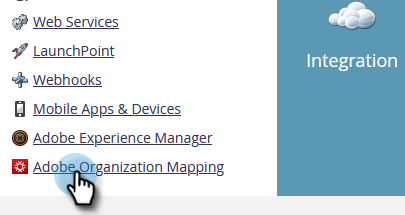
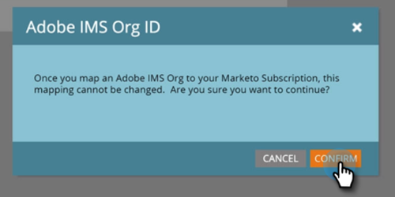

# Configurer le mappage d’organisation Adobe {#set-up-adobe-organization-mapping}

Pour synchroniser avec les applications Adobe, telles qu’Audience Manager, le connecteur Marketo B2B CDP, [!DNL Dynamic Chat], etc., vous devez d’abord saisir vos informations d’identification d’organisation Adobe IMS dans Marketo Engage.

>[!NOTE]
>
>* Un déploiement conforme à la norme HIPAA d’une instance Marketo ne peut pas utiliser cette intégration.
>* Pour que l’intégration fonctionne, Marketo et vos autres applications Adobe doivent se trouver dans la même organisation.

>[!IMPORTANT]
>
>Pour les personnes intégrées à Adobe Business Platform et au système Identity Management, l’ID d’organisation associé à l’abonnement est déjà renseigné et est un champ en lecture seule. Par conséquent, les étapes de cet article ne s’appliqueraient pas.

1. Dans Marketo, cliquez sur **[!UICONTROL Admin]**.

   

1. Sous Intégration, cliquez sur **[!UICONTROL Mappage d’organisation]**.

   

1. Cliquez sur **[!UICONTROL Modifier]**.

   

1. Saisissez votre [ID d’organisation Adobe IMS](https://experienceleague.adobe.com/docs/control-panel/using/faq.html){target="_blank"}) et cliquez sur **[!UICONTROL OK]**.

   

1. Cliquez sur **[!UICONTROL Confirmer]**.

   

1. Cliquez sur **[!UICONTROL Fermer]**.

   

   >[!IMPORTANT]
   >
   >Pour des raisons de sécurité, vous devez être un administrateur d’organisation pour l’organisation Adobe à laquelle vous souhaitez mapper. Si ce n’est pas le cas, l’action échoue. En outre, l’utilisateur Adobe et l’utilisateur Marketo doivent utiliser la même adresse e-mail lors de la connexion.

1. Si vous n’êtes _pas_ déjà connecté, un pop-up s’affiche dans un nouvel onglet ou une nouvelle fenêtre. Connectez-vous à votre organisation Adobe (cette action valide l’accès à l’organisation).

Vous pouvez désormais [partager des données d’audience](/help/marketo/product-docs/core-marketo-concepts/smart-lists-and-static-lists/static-lists/send-a-list-to-adobe-experience-cloud.md){target="_blank"} vers Adobe Experience Cloud ou [synchroniser une audience](/help/marketo/product-docs/adobe-experience-cloud-integrations/sync-an-audience-from-adobe-experience-cloud.md){target="_blank"}.
