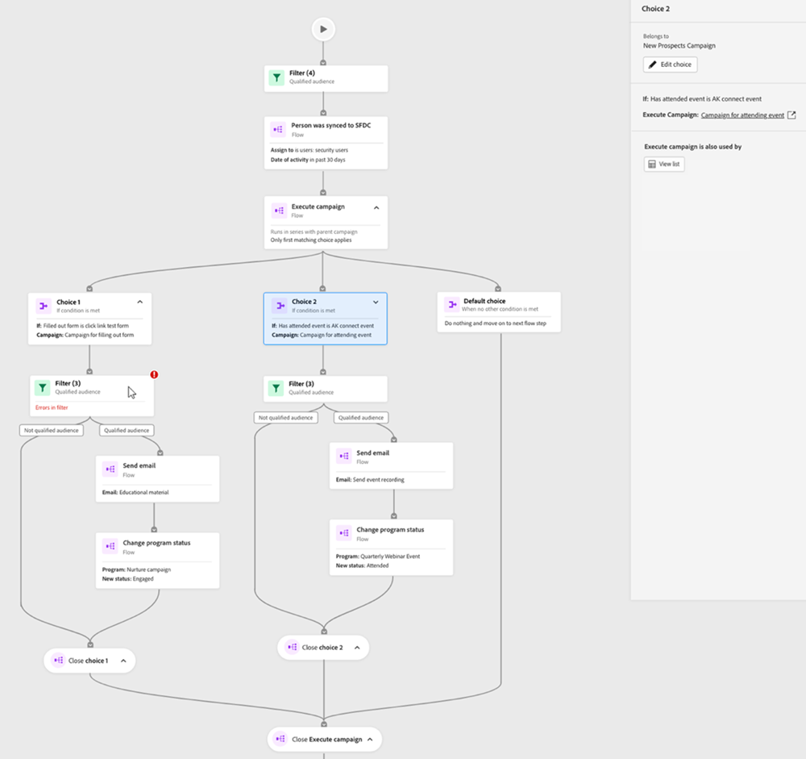

# Onglet Carte de l’engagement {#engagement-map-tab}

La carte de l’engagement est représentée par une série de cartes de déclenchement, de filtre et de flux. Cliquez sur chaque carte pour afficher des informations supplémentaires.

Présentation des triggers : cette carte affiche le nombre de triggers dans votre campagne. Cliquez dessus pour afficher une carte pour chaque déclencheur, ainsi qu’un panneau déroulant avec les informations suivantes :

* Campagne à laquelle appartient le déclencheur
* Liste des noms de déclencheurs
* Modifier le déclencheur

  

Détail du déclencheur : cette carte affiche le nom du déclencheur. Cliquez dessus pour afficher un panneau déroulant contenant les informations suivantes :

* Campagne à laquelle appartient le déclencheur
* Liste des contraintes associées au déclencheur
* Modifier le déclencheur

Filtre : cliquez sur cette carte pour afficher un panneau déroulant contenant les informations suivantes :

* Campagne à laquelle appartient le filtre
* Estimation du nombre de personnes pouvant bénéficier du filtre
* Liste des filtres et leurs contraintes respectives
* Modifier le filtre

  

Étapes de flux : si une étape de flux inclut des choix, cette carte affiche le nom de l’étape de flux. Cliquez dessus pour afficher un panneau déroulant contenant les informations suivantes :

* Campagne à laquelle appartient l’étape de flux
* Liste des conditions de choix associées à l’étape de flux
* Modifier l’étape de flux

Étapes de flux : si une étape de flux n’inclut _pas_ de choix, cette carte affiche les attributs associés à l’étape de flux. Cliquez dessus pour afficher un panneau déroulant contenant les informations suivantes :

* Campagne à laquelle appartient l’étape de flux
* Liste des attributs associés à l’étape de flux
* Modifier l’étape de flux

  

## Étape de flux pour l’exécution et la demande de campagnes {#flow-step-for-execute-and-request-campaigns}

* Si l’étape Exécuter ou Demander le flux de la campagne n’inclut aucun choix, la carte affiche le nom de la campagne. Cliquez sur la carte pour afficher un panneau déroulant contenant les informations suivantes :

   * Campagne à laquelle appartient l’étape de flux
   * Modifier l’étape de flux
   * Liste des attributs associés à l’étape de flux
   * Le bouton « Afficher la liste », qui ouvre une liste des campagnes qui utilisent le campagne Demander/Exécuter spécifique

>[!NOTE]
>
>Vous pouvez modifier la ou les étapes de flux d’une campagne principale. Pour modifier des campagnes imbriquées, vous devez accéder à la campagne à l’aide du lien dans le panneau déroulant.

* Si l’étape Exécuter ou Demander le flux de la campagne inclut des choix, cliquer sur la carte affiche un panneau déroulant avec les informations suivantes :

   * Campagne à laquelle appartient l’étape de flux
   * Liste des conditions de choix associées à l’étape de flux
   * Modifier l’étape de flux

* Si une campagne Exécuter ou Demander comprend des choix, cliquer sur la carte de flux se développe pour afficher tous les choix dans des cartes individuelles. Cliquez sur la carte _choix_ pour développer la campagne associée au choix spécifique et afficher un panneau déroulant avec les informations suivantes :

   * Campagne à laquelle appartient le choix
   * Modifier le choix
   * Liste des conditions de choix associées à l’étape de flux
   * Afficher la liste, qui ouvre une liste des campagnes qui utilisent la requête/exécution de campagne spécifique

  

## Visualiser une campagne d’exécution imbriquée {#visualizing-a-nested-execute-campaign}

Exécuter des campagnes exécutées en série avec la campagne parent. Les personnes qui remplissent les critères d’une campagne exécutable effectuent toutes les étapes de flux de la campagne et reviennent à la campagne principale pour suivre les étapes de flux de cette campagne.

Vous trouverez ci-dessous un exemple de campagne intelligente, « Campagne A », qui inclut une étape Exécuter le flux de la campagne . Considérez la « Campagne A » comme votre campagne principale.

1. Cliquez sur la carte Exécuter le flux de campagne pour développer et afficher les détails de la « Campagne B ».
1. « Campagne B » comprend un filtre qui divise l’audience en deux groupes : qualifiée et non qualifiée.
1. L’audience qualifiée passe par les étapes de flux associées à « Campagne B ».
1. Toutes les audiences (qualifiées et non qualifiées) reviennent à « Campagne A » et passent à l’étape de flux suivante.

   

Vous pouvez cliquer sur l’étape Exécuter le flux de campagne dans « Campagne B » qui s’agrandit pour afficher les cartes de choix et la campagne associées à chaque choix.

## Visualisation de la campagne de demandes {#visualizing-request-campaign}

Les campagnes de demandes s’exécutent en parallèle de la campagne parent. Les personnes qui remplissent les critères d’une campagne de demande effectuent toutes les étapes de flux de la campagne, puis quittent la campagne. Simultanément, le même ensemble de personnes passe par les étapes de flux de la campagne principale.

Voici un exemple de campagne intelligente, « Campagne A », qui inclut une étape de flux de campagne de requête. Considérez la « Campagne A » comme votre campagne principale.

1. Cliquez sur la carte Demander le flux de campagne pour afficher les détails de la « Campagne B »
1. « Campagne B » comprend un filtre qui divise l’audience en deux groupes : qualifiée et non qualifiée.
1. L’audience qualifiée passe par les étapes de flux associées à « Campagne B ».
1. Dans le même temps, toutes les audiences passent aux étapes de flux suivantes dans « Campagne A ».

   

Vous pouvez approfondir vos campagnes imbriquées si l’une des étapes de flux comprend une autre campagne de requête en cliquant sur la carte de flux pour afficher les détails de la campagne.

Voici un exemple de campagne de demandes avec des choix.

## Traitement des erreurs {#error-handling}

Les erreurs dans les listes intelligentes et les étapes de flux sont mises en surbrillance à l’aide d’une icône rouge dans la carte. En outre, un message d’erreur correspondant est reflété dans le panneau déroulant.

Les avertissements dans les listes intelligentes et les étapes de flux sont mis en surbrillance à l’aide d’une icône orange dans la carte. En outre, un message d’avertissement correspondant est reflété dans le panneau déroulant.

Vous trouverez ci-dessous un exemple d’avertissement dans une carte Choix qui s’affiche dans la carte Étape de flux de l’exécution de la campagne, le panneau déroulant et la carte Choix par défaut .

>[!NOTE]
>
>Les avertissements sont des recommandations à examiner, mais ne sont pas indicatifs d’erreurs dans la campagne intelligente.

**Les erreurs dans les cartes de filtre peuvent inclure :**

* Une erreur dans la liste dynamique se traduira par l’affichage d’une audience qualifiée

* Une erreur dans la logique du filtre

* Une erreur dans les contraintes (ou leur absence) d’un ou plusieurs filtres

  

>[!NOTE]
>
>Les erreurs survenant dans une campagne imbriquée ne sont pas visibles tant que vous n’avez pas cliqué sur pour développer la campagne imbriquée.
