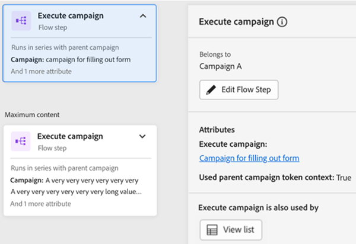

# Onglet Carte d’engagement {#engagement-map-tab}

La carte de l’engagement est représentée par une série de déclencheurs, de filtres et de cartes de flux. Cliquez sur chaque carte pour afficher des informations supplémentaires.

Présentation du déclencheur : cette carte indique le nombre de déclencheurs dans votre campagne. Si vous cliquez dessus, une carte s’affiche pour chaque déclencheur, ainsi qu’un panneau déroulant contenant les informations suivantes :

* Campagne à laquelle le déclencheur appartient
* Liste des noms des déclencheurs
* Bouton &quot;Modifier le déclencheur&quot;

  

Détails du déclencheur : cette carte affiche le nom du déclencheur. Si vous cliquez dessus, un panneau de visualisation s’affiche avec les informations suivantes :

* Campagne à laquelle le déclencheur appartient
* Liste des contraintes associées au déclencheur
* Bouton &quot;Modifier le déclencheur&quot;

  

Filtre : lorsque vous cliquez sur cette carte, un panneau de visualisation s’affiche avec les informations suivantes :

* Campagne à laquelle le déclencheur appartient
* Nombre estimé de personnes qui remplissent les critères du filtre
* Liste des filtres et leurs contraintes respectives
* Bouton &quot;Modifier le filtre&quot;

  

Étapes de flux : si une étape de flux comprend des choix, cette carte indique le nom de l’étape de flux. Si vous cliquez dessus, un panneau de visualisation s’affiche avec les informations suivantes :

* L’étape de flux de campagne appartient à
* Liste des conditions de choix associées à l’étape de flux
* Bouton &quot;Modifier le flux&quot;

  

Etapes de flux : si une étape de flux fonctionne _not_ incluez tous les choix possibles. cette carte affiche les attributs associés à l’étape de flux. Si vous cliquez dessus, un panneau de visualisation s’affiche avec les informations suivantes :

* L’étape de flux de campagne appartient à
* Liste des attributs associés à l’étape de flux
* Bouton &quot;Modifier le flux&quot;

  

## Étape de flux pour exécuter et demander des campagnes {#flow-step-for-execute-and-request-campaigns}

* Si l’étape de flux Exécuter ou Demander la campagne ne comporte aucun choix, la carte affichera le nom de la campagne. Un clic sur la carte affiche un panneau déroulant contenant les informations suivantes :

   * Campagne l’étape de flux à laquelle elle appartient
   * Bouton &quot;Modifier le flux&quot;
   * Liste des attributs associés à l’étape de flux
   * Bouton &quot;Afficher la liste&quot; qui ouvre la liste des campagnes qui utilisent la requête/exécution de campagne spécifique

>[!NOTE]
>
>Vous pouvez modifier la ou les étapes de flux d’une Principale campagne. Pour modifier les campagnes imbriquées, vous devez accéder à la campagne à partir du lien situé dans le panneau déroulant.

* Si l’étape de flux Exécuter ou Demander une campagne comporte des choix, la carte affichera le nom de la campagne. Un clic sur la carte affiche un panneau déroulant contenant les informations suivantes :

   * Campagne l’étape de flux à laquelle elle appartient
   * Liste des conditions de choix associées à l’étape de flux
   * Bouton &quot;Modifier le flux&quot;

  

  

* Si une campagne Exécuter ou Demander comprend des choix, un clic sur la carte de flux se développe afin d’afficher tous les choix dans des cartes individuelles. Cliquez sur la carte de choix pour développer la campagne associée au choix spécifique, ainsi qu’afficher un panneau déroulant contenant les informations suivantes :

   * Campagne à laquelle le choix appartient
   * Bouton Modifier le choix
   * Liste des conditions de choix associées à l’étape de flux
   * Bouton &quot;Afficher la liste&quot; qui ouvre la liste des campagnes qui utilisent la requête/exécution de campagne spécifique

  

## Visualisation d’une campagne d’exécution imbriquée {#visualizing-a-nested-execute-campaign}

Exécutez les campagnes exécutées en série avec la campagne parente. Les personnes qui remplissent les critères d’une campagne exécutable doivent suivre toutes les étapes du flux de la campagne et revenir à la Principale campagne pour continuer à suivre les étapes du flux de cette campagne.

Vous trouverez ci-dessous un exemple de campagne dynamique, &quot;Campagne A&quot;, qui comprend une étape d’exécution du flux de campagne. Considérez &quot;Campagne A&quot; comme votre Principale campagne.

1. Cliquez sur la carte d’exécution du flux de campagne pour afficher les détails de la &quot;campagne B&quot;.
1. La &quot;Campagne B&quot; comprend un filtre qui divise l&#39;audience en deux groupes : qualifiés et non qualifiés.
1. L’audience qualifiée passe en revue les étapes de flux associées à la &quot;Campagne B&quot;.
1. L’ensemble de l’audience (qualifiée et non qualifiée) revient à &quot;Campagne A&quot; et passe à l’étape de flux suivante.

   

Vous pouvez cliquer sur l’étape de flux Exécuter la campagne de la &quot;Campagne B&quot; qui s’agrandit pour afficher les cartes de choix et la campagne associées à chaque choix.

## Visualisation de la campagne de requêtes {#visualizing-request-campaign}

Les campagnes de requête s’exécutent en parallèle de la campagne parente. Les personnes qui remplissent les critères d’une campagne de requête effectuent toutes les étapes de flux de la campagne, puis quittent celle-ci. Simultanément, le même groupe de personnes passe par les étapes de flux de la Principale campagne.

Voici un exemple de campagne dynamique, &quot;Campagne A&quot;, qui comprend une étape de flux de campagne de requête. Considérez &quot;Campagne A&quot; comme votre Principale campagne.

1. Cliquez sur la carte de flux de campagne de requête pour afficher les détails de la &quot;campagne B&quot;.
1. La &quot;Campagne B&quot; comprend un filtre qui divise l&#39;audience en deux groupes : qualifiés et non qualifiés.
1. L’audience qualifiée passe en revue les étapes de flux associées à la &quot;Campagne B&quot;.
1. En même temps, toutes les audiences passent aux étapes de flux suivantes de la &quot;Campagne A&quot;.

   

Vous pouvez approfondir l’analyse de vos campagnes imbriquées si l’une des étapes de flux inclut une autre campagne de requête en cliquant sur la carte de flux pour afficher les détails de la campagne.

Voici un exemple de campagne de requêtes avec des choix.

## Gestion des erreurs {#error-handling}

Les erreurs des listes dynamiques et des étapes de flux sont mises en surbrillance au moyen d’une icône d’erreur dans la carte. En outre, un message d’erreur correspondant sera reflété dans le panneau de visualisation.

Vous trouverez ci-dessous un exemple d’erreur dans un déclencheur qui s’affiche dans la carte d’aperçu du déclencheur, le panneau déroulant et la carte de déclencheur détaillée.

**Les erreurs dans les cartes de filtre peuvent inclure :**

* Une erreur dans la liste dynamique qui empêchera l’affichage d’une audience qualifiée

* Une erreur dans la logique de filtre

* Une erreur dans les contraintes (ou leur absence) d’un ou plusieurs filtres

  

>[!NOTE]
>
>Les erreurs au sein d’une campagne imbriquée ne seront pas visibles tant que vous n’aurez pas cliqué pour développer la campagne imbriquée.
