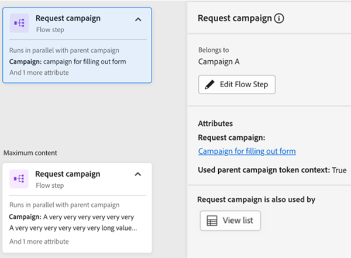
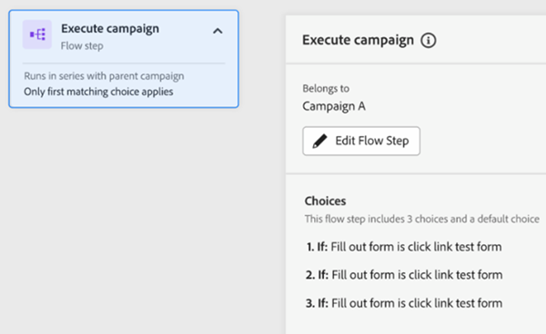
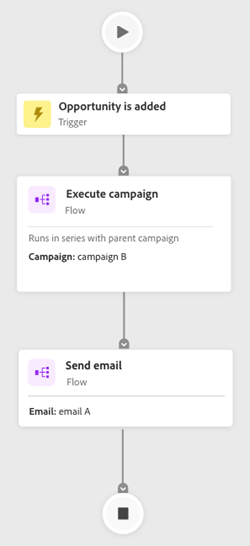
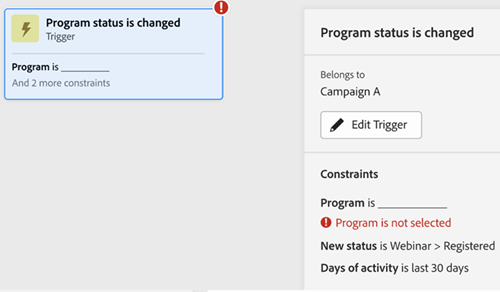
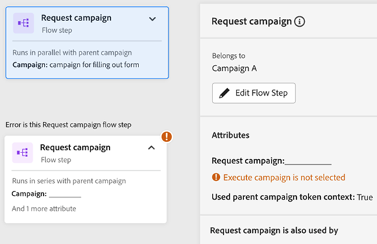

# Onglet Carte d’engagement {#engagement-map-tab}

La carte de l’engagement est représentée par une série de déclencheurs, de filtres et de cartes de flux. Cliquez sur chaque carte pour afficher des informations supplémentaires.

Présentation du déclencheur : Cette carte indique le nombre de déclencheurs dans votre campagne. Si vous cliquez dessus, une carte s’affiche pour chaque déclencheur, ainsi qu’un panneau déroulant contenant les informations suivantes :

* Campagne à laquelle le déclencheur appartient
* Liste des noms des déclencheurs
* Bouton &quot;Modifier le déclencheur&quot;

  

Détails du déclencheur : Cette carte affiche le nom du déclencheur. Si vous cliquez dessus, un panneau de visualisation s’affiche avec les informations suivantes :

* Campagne à laquelle le déclencheur appartient
* Liste des contraintes associées au déclencheur
* Bouton &quot;Modifier le déclencheur&quot;

  

Filtre : Cliquez sur cette carte pour afficher un panneau de visualisation avec les informations suivantes :

* Campagne à laquelle le déclencheur appartient
* Nombre estimé de personnes qui remplissent les critères du filtre
* Liste des filtres et leurs contraintes respectives
* Bouton &quot;Modifier le filtre&quot;

  

Etapes de flux : Si une étape de flux comprend des choix, cette carte indique le nom de l’étape de flux. Si vous cliquez dessus, un panneau de visualisation s’affiche avec les informations suivantes :

* L’étape de flux de campagne appartient à
* Liste des conditions de choix associées à l’étape de flux
* Bouton &quot;Modifier le flux&quot;

  

Etapes de flux : Si une étape de flux fonctionne _not_ incluez tous les choix possibles. cette carte affiche les attributs associés à l’étape de flux. Si vous cliquez dessus, un panneau de visualisation s’affiche avec les informations suivantes :

* L’étape de flux de campagne appartient à
* Liste des attributs associés à l’étape de flux
* Bouton &quot;Modifier le flux&quot;

  

## Étape de flux pour exécuter et demander des campagnes {#flow-step-for-execute-and-request-campaigns}

* Si l’étape de flux Exécuter ou Demander la campagne ne comporte aucun choix, la carte affichera le nom de la campagne. Un clic sur la carte affiche un panneau déroulant contenant les informations suivantes :

   * Campagne l’étape de flux à laquelle elle appartient
   * Bouton &quot;Modifier le flux&quot;
   * Liste des attributs associés à l’étape de flux
   * Bouton &quot;Afficher la liste&quot; qui ouvre la liste des campagnes qui utilisent la requête/exécution de campagne spécifique

>[!NOTE]
>
>Vous pouvez modifier la ou les étapes de flux d’une Principale campagne. Pour modifier les campagnes imbriquées, vous devez accéder à la campagne à partir du lien situé dans le panneau déroulant.

* Si l’étape de flux Exécuter ou Demander une campagne comporte des choix, la carte affichera le nom de la campagne. Un clic sur la carte affiche un panneau déroulant contenant les informations suivantes :

   * Campagne l’étape de flux à laquelle elle appartient
   * Liste des conditions de choix associées à l’étape de flux
   * Bouton &quot;Modifier le flux&quot;

  

  

* Si une campagne Exécuter ou Demander comprend des choix, un clic sur la carte de flux se développe afin d’afficher tous les choix dans des cartes individuelles. Cliquez sur la carte de choix pour développer la campagne associée au choix spécifique, ainsi qu’afficher un panneau déroulant contenant les informations suivantes :

   * Campagne à laquelle le choix appartient
   * Bouton Modifier le choix
   * Liste des conditions de choix associées à l’étape de flux
   * Bouton &quot;Afficher la liste&quot; qui ouvre la liste des campagnes qui utilisent la requête/exécution de campagne spécifique

  

## Visualisation d’une campagne d’exécution imbriquée {#visualizing-a-nested-execute-campaign}

SÉLECTIONNER LES MODIFICATIONS ICI—

Exécutez les campagnes exécutées en série avec les personnes de campagne parentes qui remplissent les critères d’une campagne exécutable. Suivez toutes les étapes du flux de la campagne et revenez à la Principale campagne pour continuer à suivre les étapes du flux de cette campagne.

Vous trouverez ci-dessous un exemple de campagne dynamique, &quot;Campagne A&quot;, qui comprend une étape d’exécution du flux de campagne. Considérez &quot;Campagne A&quot; comme votre Principale campagne.

1. Cliquez sur la carte d’exécution du flux de campagne pour afficher les détails de la &quot;campagne B&quot;.
1. La &quot;Campagne B&quot; comprend un filtre qui s’étend à une audience qualifiée et non qualifiée.
1. L’audience qualifiée suit les étapes de flux associées à la &quot;Campagne B&quot;.
1. L’ensemble de l’audience (qualifiée et non qualifiée) revient à &quot;Campagne A&quot; et passe à l’étape de flux suivante.

CETTE ÉDITION A ÉTÉ ARRÊTÉE ICI —

Vous pouvez cliquer sur l’étape de flux Exécuter la campagne de la &quot;Campagne B&quot; qui s’agrandit pour afficher les cartes de choix et la campagne associées à chaque choix.

## Visualiser une campagne de requêtes {#visualizing-request-campaign}

Les campagnes de requête s’exécutent en parallèle de la campagne parente, c’est-à-dire que les pistes qui remplissent les critères d’une campagne de requête effectuent toutes les étapes de flux de la campagne et quittent la campagne. En parallèle, le même ensemble de pistes passe également par les étapes de flux de la campagne Principale.

Voici un exemple de campagne dynamique &quot;Campagne A&quot; qui comprend une étape de flux de campagne de requête. Vous pouvez considérer la &quot;Campagne A&quot; comme votre Principale campagne.

1. Cliquez sur la carte de flux de campagne de requête pour afficher les détails de la &quot;campagne B&quot;.
1. La campagne B comprend un filtre qui s’étend à une audience qualifiée.
1. L’audience qualifiée passe en revue les étapes de flux associées à la &quot;campagne B&quot;.
1. En parallèle, toutes les audiences passent aux étapes de flux suivantes dans &quot;Campagne A&quot;

   

Vous pouvez approfondir l’analyse des campagnes imbriquées si l’une des étapes de flux inclut une autre campagne de requête en cliquant sur la carte de flux pour afficher les détails de la campagne.

Voici un exemple de campagne de requête avec choix.

## Gestion des erreurs {#error-handling}

Les erreurs dans les étapes de flux et de liste dynamique sont mises en surbrillance par l’icône d’erreur dans la carte. En outre, le message d’erreur correspondant sera reflété dans le panneau de sortie.

Voici un exemple d’erreur dans le déclencheur qui sera indiqué dans la carte d’aperçu du déclencheur, le panneau déroulant ainsi que la carte de déclencheur détaillée.

Une erreur dans la carte de filtre peut inclure

Erreur dans la liste dynamique, ce qui empêchera l’affichage de l’audience qualifiée

Erreur dans la logique de filtre

Erreur dans les contraintes ou absence de contraintes dans un ou plusieurs filtres

Si vous ne saisissez pas de valeurs (attributs), elles ne seront pas marquées comme des erreurs, car elles continueront à fonctionner comme dans l’onglet Flux . Par conséquent, les campagnes existantes ne seront pas perturbées. Cependant, lorsque les étapes de flux n’incluent aucun attribut, elles s’affichent sous la forme d’avertissements.

Remarque : Les erreurs d’une campagne imbriquée ne seront pas visibles tant que vous n’aurez pas cliqué pour développer la campagne imbriquée.
