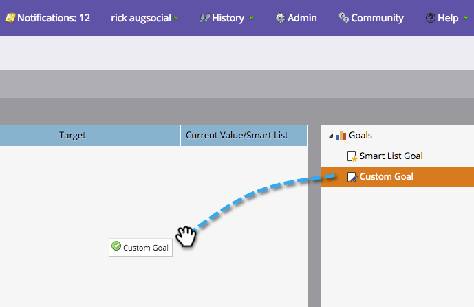

# Créer un objectif personnalisé {#create-a-custom-goal}

Les objectifs sont des moyens de suivre les progrès et de motiver votre équipe. Une fois créés, ils doivent être mis à jour manuellement.

Tout comme les présentations, les objectifs sont spécifiques à [l’espace](../../../../product-docs/administration/workspaces-and-person-partitions/understanding-workspaces-and-person-partitions.md)de travail.

1. Accédez au **calendrier**.

   

1. Cliquez sur **Présentation** dans le coin inférieur droit.

   

1. Sélectionnez l&#39;onglet** Objectifs**.

   

1. Faites glisser et déposez l’objectif **** personnalisé dans le canevas.

   

1. Entrez un nom pour l&#39;objectif. Sélectionnez une **devise**.

   >[!NOTE]
   >
   >Si l’objectif n’est pas une valeur monétaire, vous pouvez sélectionner **Aucun**.

   

1. Entrez une valeur pour la Cible **** d&#39;objectif et la valeur **** actuelle (s&#39;il n&#39;y en a pas une, **entrez 0**). Cliquez ensuite sur **Créer**.

   

   Votre objectif personnalisé a été créé !

   

