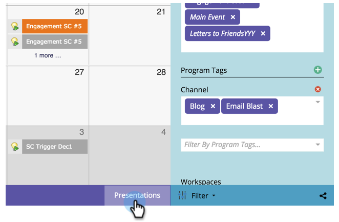

# Créer une présentation {#create-a-presentation}

Créez une présentation pour projeter les vues du calendrier et les objectifs de votre équipe sur une TVHD. Les présentations sont spécifiques à Workspace.

>[!AVAILABILITY]
>
>
>Tous les utilisateurs de Marketo Engage n’ont pas acheté cette fonctionnalité. Pour plus d’informations, contactez l’équipe du compte Adobe (votre gestionnaire de compte).

1. Accédez au **[!UICONTROL Calendrier]**.

   

1. Cliquez sur **[!UICONTROL Présentations]** dans le coin inférieur droit.

   

1. Cliquez sur **[!UICONTROL Actions de présentation]** et sélectionnez **[!UICONTROL Nouvelle présentation]**.

   

1. Choisissez un nom pour la présentation. Cliquez sur **[!UICONTROL Créer]**.

   

   Joli travail ! Vous êtes maintenant prêt à personnaliser votre présentation.

>[!MORELIKETHIS]
>
>[Personnaliser une présentation](/help/marketo/product-docs/core-marketo-concepts/marketing-calendar/calendar-hd/customize-a-presentation.md)
