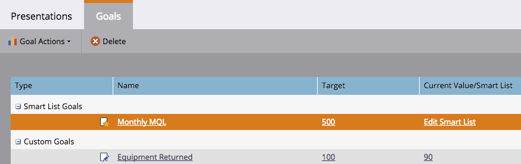

# Créer un objectif de Liste intelligente {#create-a-smart-list-goal}

Les objectifs sont des moyens de suivre les progrès et de motiver votre équipe. Ils peuvent être combinés à des listes intelligentes pour suivre toutes sortes de choses sur le marché. De plus, une fois que vous avez configuré un objectif de liste intelligent, il se met automatiquement à jour toutes les 2 heures lorsqu&#39;il est utilisé dans une présentation.

Tout comme les présentations, les objectifs sont spécifiques à [l’espace](../../../../product-docs/administration/workspaces-and-person-partitions/understanding-workspaces-and-person-partitions.md)de travail.

1. Accédez au **calendrier**.

   

1. Cliquez sur **Présentation** dans le coin inférieur droit.

   

1. Sélectionnez l&#39;onglet** Objectifs**.

   

1. Faites glisser **Smart Liste Goal** sur le canevas.

   

1. Saisissez un nom pour l’objectif et une Cible **d’** objectif. Cliquez ensuite sur **Créer**.

   

1. [Définissez la liste](../../../../product-docs/core-marketo-concepts/smart-lists-and-static-lists/creating-a-smart-list/find-and-add-filters-to-a-smart-list.md)intelligente. Les possibilités sont infinies !

   

1. Une fois la liste dynamique définie, cliquez sur le bouton **Fermer** et revenez à l’onglet précédent.

   

   Regardez ça ! Votre objectif de liste intelligente a été créé.

   

